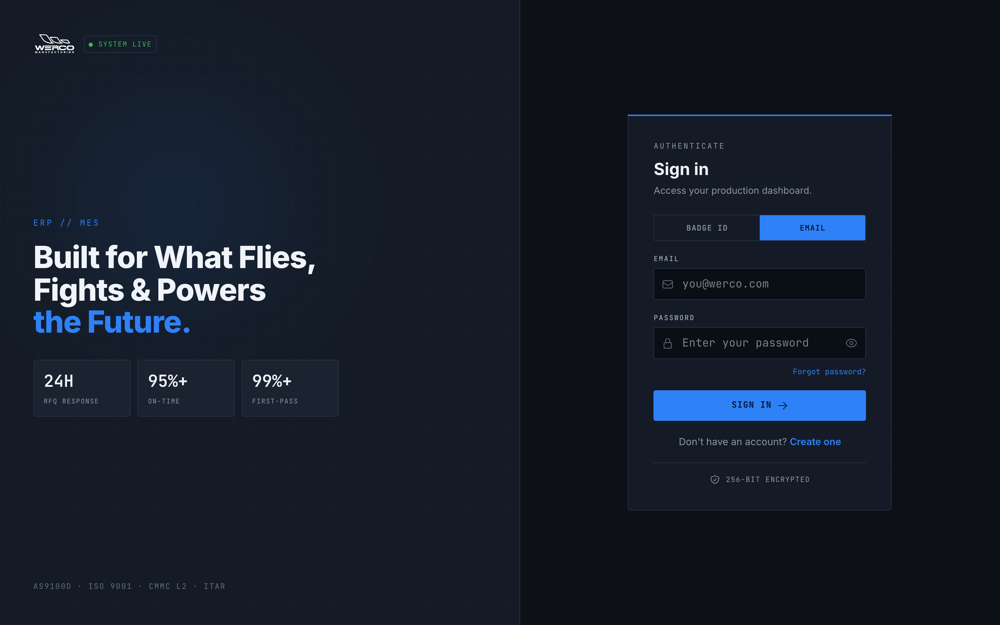
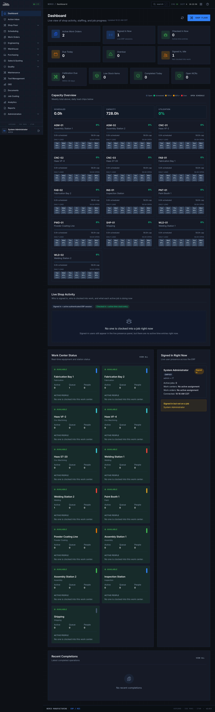
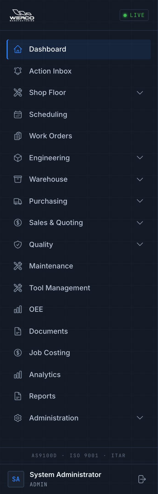
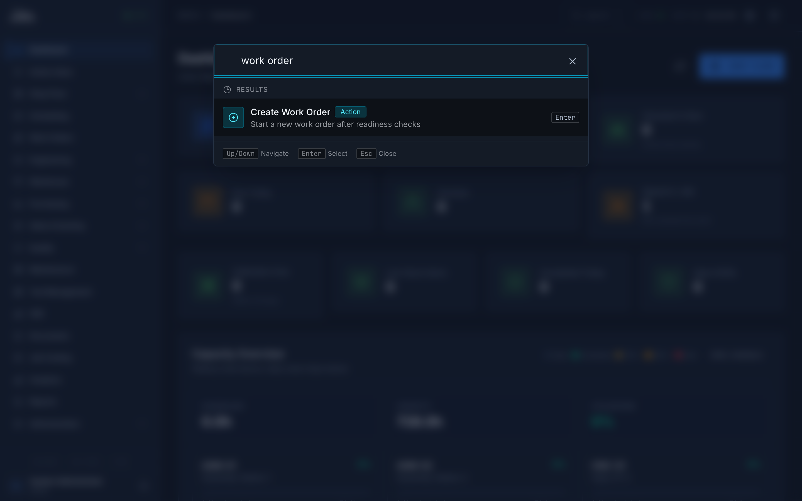
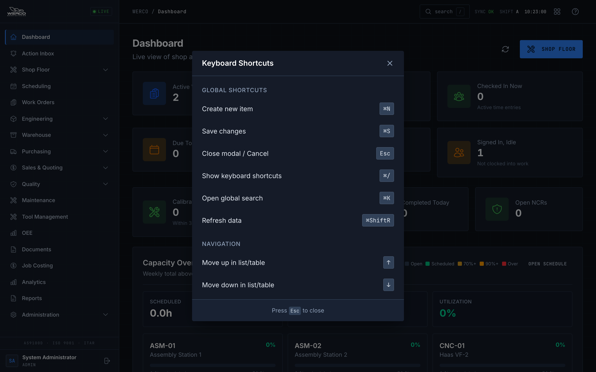

# Getting Started with Werco ERP-MES

**Who this is for:** Everyone at Werco who uses the system — operators, supervisors, quality, shipping, purchasing, office staff, and managers. This is the first guide you should read. Later guides cover your specific job.

**What you'll be able to do:** Sign in (at your desk or at a shop-floor station), find your way around the screen, read your home Dashboard, search for anything in seconds, use a few handy keyboard shortcuts, and understand when and why the system signs you out.

---

## Signing in

Your account is created for you by your administrator. You don't sign yourself up. When you start, your administrator or IT will give you your sign-in details and tell you which way to sign in.

*The sign-in screen. Pick how you want to sign in at the top, then enter your details.*

There are two ways to sign in. At the top of the sign-in box you'll see two buttons: **Badge ID** and **Email**. Click the one that matches how you sign in.

### Sign in with email and password

Use this if you work at a desk or you've been given an email login.

1. Click the **Email** button at the top of the sign-in box.
2. Type your work **Email** address.
3. Type your **Password**. (Click the eye icon on the right of the password box if you want to see what you typed.)
4. Click **Sign In**.

> Tip: Forgot your password? Ask your administrator to reset it for you — that's the way to get a new password today.

### Sign in with your badge at a shop-floor station

Shop-floor stations (kiosks) let you sign in fast with just your employee or badge ID — no password needed. This is the usual way for operators.

1. Click the **Badge ID** button at the top of the sign-in box.
2. In the **Employee / Badge ID** box, type your badge number (for example `0339`) or your full employee ID (for example `EMP-1001`).
3. Click **Sign In**.

> Tip: Your 4-digit badge ID works even if you type it short or long. Typing `339`, `0339`, or your full employee ID will all sign you in to the same account.

> Heads up: Shop-floor stations are shared. When you're done, sign yourself out so the next person doesn't run work under your name. At a station you sign out by entering your badge ID again — the system asks for it to confirm it's really you.

---

## If you get locked out or forget your password

For security, the system locks an account after **5 wrong password tries** on the **Email** sign-in. The account stays locked for **30 minutes**.

- This lockout is for the **email-and-password** way of signing in. Badge sign-in at a station has no password, so mistyping a badge ID doesn't lock you out — but an account that's already locked (from email tries) or has been deactivated can't badge in either.
- If you're locked out, you can wait 30 minutes and try again — or, faster, **contact your administrator** and they can unlock you right away.
- If you forgot your password, **ask your administrator to reset it** for you. That's the only way to get a new password today.

> Heads up: Don't keep guessing your password once you've gotten it wrong a few times — you'll lock yourself out. Slow down and check your details, or ask for help.

---

## Your home screen: the Dashboard

After you sign in, most people land on the **Dashboard** — your live picture of the shop. (Operators are taken straight to their shop-floor station instead.) The Dashboard refreshes itself automatically, so what you see is current.

*The Dashboard is the first thing most people see after signing in.*

Here's what's on it, top to bottom:

- **Alerts** — colored bars at the top that flag things needing attention: overdue work orders, open NCRs (quality issues), equipment due or overdue for calibration, and low or critical stock. Click any alert to jump straight to it.
- **KPI cards** — quick numbers at a glance. The top row shows **Active Work Orders**, **Signed In Now**, **Checked In Now**, **Due Today**, **Overdue**, and **Signed In, Idle** (people signed in but not clocked into a job). The next row shows **Calibration Due**, **Low Stock Items**, **Completed Today**, and **Open NCRs**. Click a card to see the details behind it.
- **Capacity Overview** — a colored grid showing how busy each work center is over the next 7 days. Green means open or scheduled, amber means busy (70%+), and red means over capacity. Click any day to open the schedule.
- **Live Shop Activity** — who's clocked into a job right now, grouped by work center, with live progress on each job.
- **Signed In Right Now** — who is currently signed in across the system, and whether they're on a job ("Checked In") or just signed in ("Signed In").
- **Recent Completions** — the latest operations that were finished, who finished them, and how many units.

> Tip: "Signed in" and "Checked in" mean different things. **Signed in** means someone has the system open. **Checked in** means they're actually clocked into a job on the time clock.

---

## Finding your way around

Everything is reached from the menu on the left side of the screen — the sidebar. It's grouped by area of work, so related screens sit together.

*The sidebar groups every screen by the kind of work it's for. Click a group to expand it.*

The main groups are:

- **Dashboard** and **Action Inbox** — your home view and your to-do items.
- **Shop Floor** — Time Clock, Operations (the station view), and Downtime.
- **Scheduling** and **Work Orders** — planning and tracking jobs.
- **Engineering** — Parts, Bill of Materials, Routing, and Engineering Changes.
- **Warehouse** — Inventory, Materials & Supplies, Receiving, and Shipping (all in one place).
- **Purchasing** — Purchase Orders, Upload PO, and MRP.
- **Sales & Quoting** — AI RFQ Quote, Quote Calculator, Quotes, and Customers.
- **Quality** — NCR / CAR / FAI, SPC, Calibration, Traceability, Customer Complaints, and QMS Standards.
- **Maintenance**, **Tool Management**, **OEE**, **Documents**, **Job Costing**, **Analytics**, and **Reports** — operations and reporting screens.
- **Administration** — setup, users, work centers, certifications, audit log, and settings.

> Heads up: You'll only see the parts of the menu your role is allowed to use. If a screen a coworker mentions isn't in your sidebar, your role probably doesn't include it — that's normal, not a bug.

To open a screen: click a group to expand it, then click the screen you want. On a phone or tablet, tap the menu button (the three lines) at the top to open the sidebar.

---

## Search anything fast

You don't have to hunt through menus. There's a search box that finds work orders, parts, customers, and more across the whole system.

*Search finds work orders, parts, customers, and more — from anywhere in the app.*

To search:

1. Press **Ctrl + K** (or just the **/** key), or click the **search** (magnifying-glass) button near the top-right of the screen.
2. Start typing what you're looking for — a work order number, a part number, a customer name.
3. Click a result to go straight to it.

> Tip: This is usually the fastest way to get anywhere. When in doubt, search.

---

## Keyboard shortcuts

A few keyboard shortcuts save time once you know them. To see the full list at any time, press **Ctrl + /** — a window titled **Keyboard Shortcuts** opens.

*Press Ctrl + / anytime to see this list of shortcuts.*

The handy ones:

| Shortcut | What it does |
| --- | --- |
| **Ctrl + K** | Open search |
| **Ctrl + .** | Open or close the Werco Copilot assistant (ask questions about your jobs, schedules, and inventory) |
| **Ctrl + N** | Create a new item (on screens that support it) |
| **Ctrl + S** | Save your changes |
| **Ctrl + Shift + R** | Refresh the data on screen |
| **Esc** | Close a window or cancel |

> Tip: You don't need to memorize these. Search (Ctrl + K) and Esc are the two most worth learning first.

---

## Guided tours & in-app help

You're not on your own. The system has built-in help:

- **Guided tours** walk you through a screen step by step, pointing out the important buttons. The tours adjust to your role, so you only see what's relevant to your job.
- A **Help & Tours menu** near the top-right of the screen lets you start a tour or find help whenever you want.

> Tip: If a screen looks unfamiliar, look for the help menu in the top bar and start the tour for that page.

---

## Staying signed in (and getting signed out)

The system keeps you signed in while you're working and refreshes your session quietly in the background — you won't normally notice. You don't need to keep signing in throughout your shift.

For security, though, your session won't last forever:

- After a while of having the app open, the system signs you out automatically and asks you to sign in again.
- The longest a single sign-in lasts is about **one day**. After that you'll always be asked to sign in fresh.
- You may get a brief warning before you're signed out, so you can save your work.

> Heads up: Never share your account or let someone else work under your sign-in. The system records who did what for audit and traceability — work done under your account is recorded as done by you. At a shared station, always sign out when you step away.

---

## Common problems

| Symptom | What to do |
| --- | --- |
| "Login failed" message | Double-check your email/badge ID and password. On a station, make sure **Badge ID** is selected; at a desk, make sure **Email** is selected. |
| Account locked after several tries | You hit the 5-try limit on **Email** (password) sign-in. Wait 30 minutes, or ask your administrator to unlock you now. (Badge sign-in has no password and doesn't cause this.) |
| Forgot your password | Ask your administrator to reset it for you — that's the only way to get a new password today. |
| Don't have an account yet | Your administrator creates accounts. Ask your supervisor or administrator to set you up. |
| A screen you expected isn't in the menu | Your role may not include it. Check with your supervisor — this is usually normal. |
| Suddenly asked to sign in again | Your session timed out (this is normal, up to about a day). Just sign in again. |
| Dashboard numbers look stale | Click the refresh button at the top of the Dashboard, or press **Ctrl + Shift + R**. |
| Someone else's name is on your work | The previous person didn't sign out of the shared station. Sign them out (or sign in fresh) and tell your supervisor. |

---

## Where to get help

Ask your **supervisor** first for day-to-day questions. For account problems — getting unlocked, password resets, or a new account — **contact your administrator or IT**. New to a term you see on screen? Check the **[Glossary](./glossary.md)**.

---

## Try it

A two-minute warm-up the first time you sign in:

1. Sign in the way your administrator told you (**Email** at a desk, or **Badge ID** at a station).
2. On the **Dashboard**, read the alert bars and KPI cards at the top. Click one card to see the detail behind it, then come back.
3. Press **Ctrl + K** (or **/**) to open **search**, type a work order or part you know, and open a result.
4. Press **Ctrl + /** to open the **Keyboard Shortcuts** window and skim the list. Press **Esc** to close it.
5. If you're at a shared station, **sign out** when you're done so the next person doesn't run work under your name.
