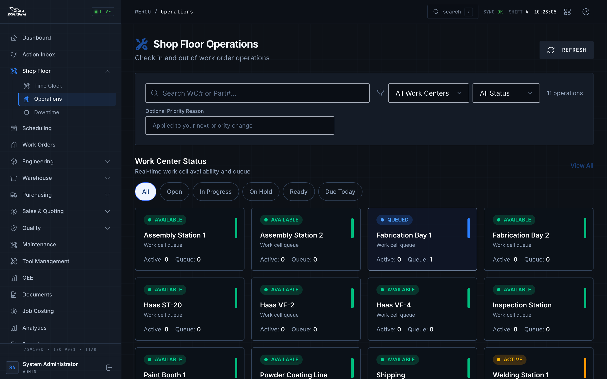
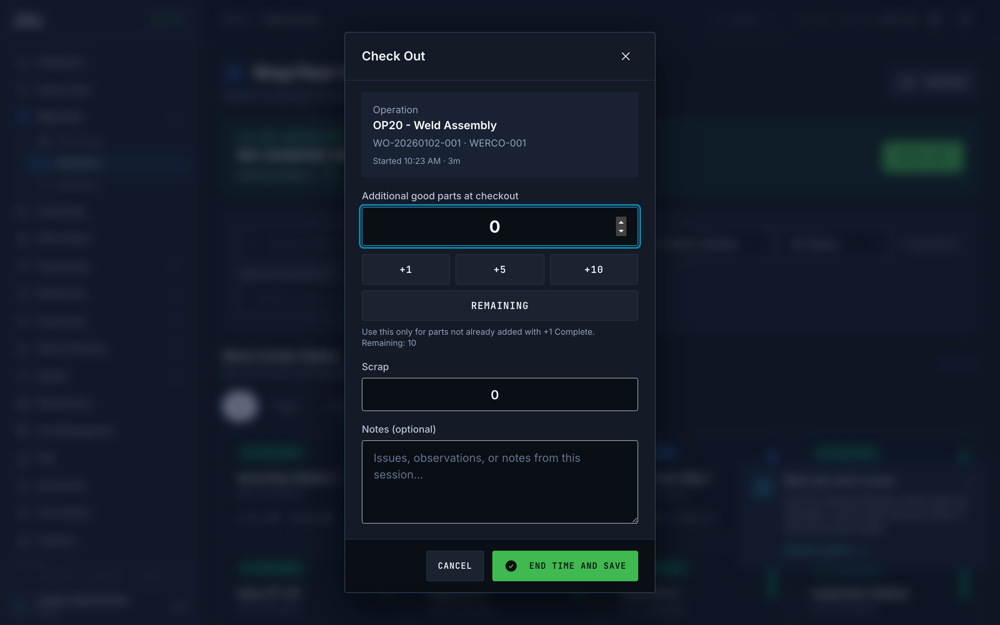
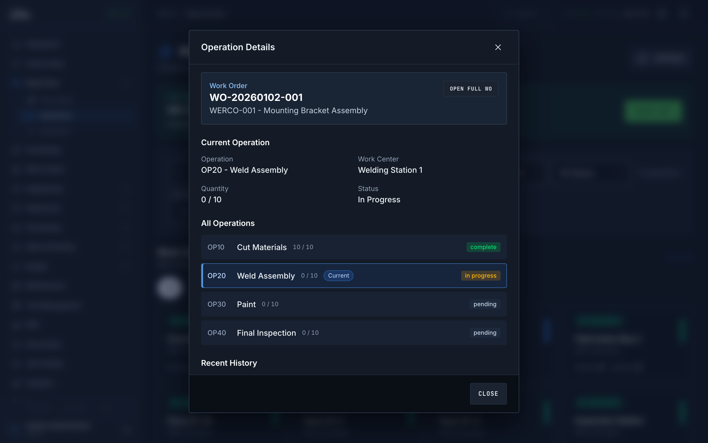

# Operator Guide: Running Work on the Shop Floor

**Who this is for:** Operators and team leads who run day-to-day work at a station — sheet metal, CNC, fabrication, welding, paint, assembly, and inspection cells.

**What you'll be able to do:** Sign in at the kiosk, find your most important job fast, start and pause work, record the parts you make (good and scrap), read setup and run instructions, and hand off cleanly at the end of your shift.

---

## Clocking in at the kiosk

When you sign in, the system takes you straight to the **Shop Floor Operations** screen — the kiosk. This is where you spend almost all of your time.

> Heads up: Your administrator or IT will create your account and give you your sign-in details. At many stations you sign in with your employee badge number instead of a password. Never share your sign-in.

*The kiosk opens to your station's work, ranked so the most important job is on top.*

### Start-of-shift checklist

Run through this every time you start, before you touch a part:

1. **Confirm your station.** Look at the **Work Center Status** cards near the top. The card with the bright outline is your selected station. If it's wrong, tap the correct one (or use the **Change Station** link on a phone/tablet). What you'll see: the screen filters down to just that station's work.
2. **Review the queue.** Read the **Most Important Next** list. That's your recommended order of work.
3. **Open the details before a new part.** For any part you haven't run before, tap **Details** first and read the setup and run instructions. Don't start cutting metal on a part you haven't read up on.

---

## The fixed station kiosk (big-button touchscreens)

Some cells have a dedicated wall or machine-side touchscreen that runs a simpler, big-button version of the kiosk, set up by IT for that one station. If your cell has one, it works like this:

1. **Scan your badge** (or type your employee number on the on-screen pad and press the arrow). You don't need to tap anything first — just scan.
2. The screen shows **your station's queue**. Tap a job, then tap **CLOCK IN**. That's it — two taps.
3. While you're on a job, a banner stays pinned at the top with three big buttons: **REPORT PRODUCTION** (enter good and scrap on the keypad — any scrap makes you pick a reason from the grid, no skipping it), **COMPLETE** (closes your time and finishes the step), and **HOLD** (pick why the job is stopping — material missing, machine down, and so on).
4. **It logs you out by itself** after about 4 minutes of no touching, with a countdown warning first — tap anywhere to stay on. Always scan in as yourself; never work under someone else's badge.

If the screen shows a red **OFFLINE** banner, the kiosk lost its connection — what you've typed stays on screen, but nothing saves until it reconnects. If a button refuses with a message (an earlier step isn't done, the job is on hold), that's the same sequence protection described below — run the next job and tell your lead.

---

## Your work queue: Most Important Next

The **Most Important Next** panel is your focus list. It shows the top jobs to work, in order. The system ranks them automatically using:

1. **Overdue and due pressure** — anything past its due date or due today floats to the top. Overdue jobs are flagged **OVERDUE** in red.
2. **Work order priority** — shown as a tag from **P1** (highest) down to **P10** (lowest). P1 and P2 show in red, P3–P5 in amber.
3. **A dispatch score** that balances priority, due date, and how much work is left, with due date as the tie-breaker.

**Run the job at the top of the list unless your supervisor tells you otherwise.** If you do need to work something out of order, that's fine — just add a note when you record your work so the next person understands why.

*Work top-down. Number 1 is the system's best pick for what to run next.*

---

## Finding work fast

If the list is long, narrow it down. The filters are right at the top of the screen:

1. **Work center cards** — tap your station to lock the view to just your cell. Tap **View All** (or **All Work Centers**) to see everything again.
2. **Status pills** — **All**, **Open**, **In Progress**, **On Hold**, **Ready**, and **Due Today**. Tap one to show only that kind of work.
3. **Actionable Only** — turns the list down to just the jobs you can act on right now (open, ready, in progress, or on hold). This is usually on by default when a station is selected.
4. **Search** — type a work order number or part number in the **Search** box to jump straight to it.
5. **Scan** (on phone/tablet) — tap **Scan**, then scan or type a traveler code to pull up that job.

> Tip: If your queue looks empty but you know there's work, you probably have a filter on. Tap **All**, turn off **Due Today**, and clear the search box.

---

## Starting an operation

1. Find the job card for the operation you want to run. Its status should read **pending** or **ready**.
2. Tap **Check In**. What you'll see: the status changes to **in progress**, and a green "You are checked into…" banner appears at the top with a running timer.
3. If you need the instructions, tap **Details** to open them in a window.

### What if Check In won't work

If the **Check In** button is greyed out or shows **Waiting**, the job isn't ready for you yet. Common reasons:

- **An earlier step isn't done.** Work flows step by step. If the operation before yours (often at another station) hasn't been completed, you can't check in. The button will say **Waiting** with a note that a previous work center must finish first.
- **The job is on hold.** Someone paused it. See "Resuming held work" below.
- **The job is blocked.** There may be a reported problem (missing material, machine down, quality hold) stopping it.

What to do: pick the next job in the list and let your supervisor know the top job is stuck.

---

## Putting work on hold

Pause a job whenever you have to step away or hit a problem you can't fix at the machine.

1. On an **in progress** job card, tap **Hold**.
2. What you'll see: the status changes to **on hold** and the card turns red-tinted.
3. **Tell your lead or supervisor why it's on hold** — right away, in person or by your normal handoff method.

> Heads up: Use Hold for things like a break, a missing tool, or a question. If you find a **nonconforming or suspect part**, do not just quietly hold it and move on — flag it to quality. Never work around a hold to keep a bad part moving.

---

## Resuming held work

1. Find the job with status **on hold** (the **On Hold** status pill filters to these fast).
2. Tap **Check In**. What you'll see: the job goes back to **in progress** and your timer starts again.
3. If the hold was for a problem, make sure it was actually resolved before you restart.

---

## Recording your work (complete or partial)

Record what you make as you go. There are three ways, depending on how you like to work:

**The fast way — one part at a time:**
- Each time you finish a good part, tap **+1 Complete** on the job card. The progress bar ticks up. This is the simplest method for most stations.

**The batch way — several at once:**
1. Tap **More** to open the **Add Completed Quantity** window.
2. Enter the number of **Good parts to add** (or tap **+1**, **+5**, **+10**, or **Remaining**).
3. Enter any **Scrap to add**.
4. Add **Notes** if anything was off.
5. Tap **Add to Completed**.

**At the end of a session — checking out:**
1. Tap **Check Out** to open the **Check Out** window.
2. Enter any **Additional good parts at checkout** — only parts you haven't already counted with **+1 Complete**.
3. Enter **Scrap**.
4. Add **Notes** about issues or observations from this session.
5. Tap **End time and save**. This stops your timer and saves your counts.

*Record good parts, scrap, and notes when you check out of a job.*

### How partial vs. full completion works

- If your total completed quantity is **less than the ordered quantity**, the operation stays **in progress**. The progress bar shows how far along it is. You (or the next shift) can pick it right back up.
- When the completed quantity **reaches the ordered quantity**, the operation is finished. When the target is reached you'll see a green **Target quantity reached** banner with a **Complete Operation** button — tap it to close the step out.

> Tip: Always enter scrap when it happens, not at the end of the day from memory. Accurate scrap counts are part of our quality records.

---

## Reading the operation details and instructions

Tap **Details** on any job card to open the **Operation Details** window. It shows everything you need to run the step right:

*Operation Details: the work order, your current step, instructions, the full sequence, and recent history.*

- **Work Order** — the WO number, part number, and part name. **Open Full WO** jumps to the complete work order page.
- **Current Operation** — the operation name, work center, quantity so far, and status.
- **Work Instructions** — **Setup Instructions** (amber) and **Run Instructions** (blue). Read both before your first article on a new part.
- **All Operations** — the full list of steps for this work order and the status of each. Your current step is marked **Current**. This tells you what came before you and what comes after.
- **Recent History** — the latest events on this operation (who started it, completions, holds), with timestamps.

> Tip: Read the setup and run instructions out loud on a first article. It catches mistakes before you make a batch of them.

---

## Travelers

A **traveler** is the hard-copy routing packet that rides along with a job through the shop. If your cell uses them, the printed traveler lists the part, the operations in order, and sign-off spots.

- To print one, open the full work order (use **Open Full WO** from the details window) and tap **Print Traveler**.
- Where your area requires a traveler, keep it with the parts and fill it in as you go. The kiosk and the paper traveler should always tell the same story.

---

## Good data habits and quality

What you record on the kiosk becomes part of our quality and traceability record. Keep it honest and complete:

- **Log notes for anything abnormal** — a tool change, an unusual reading, a setup tweak, a hold reason. Future you (and the auditor) will thank you.
- **Never bypass a hold for a nonconforming or suspect part.** If a part looks wrong, stop and flag it to quality. Don't work around it to hit a number.
- **Report scrap and rework when it happens**, at the real quantity. Don't round, don't guess later.
- **Don't run a step you can't check into.** If the system says an earlier step isn't done, trust it — the sequence protects the part.

---

## End-of-shift checklist

Before you leave, leave the floor clean for the next shift:

1. **Close out your active job.** Don't leave a job running with you "checked in" if you've stopped working it — tap **Check Out** and save your counts.
2. **Add notes to anything partially done**, so the next person knows where you left off.
3. **Put blocked work on hold** with a clear handoff note about what's wrong.
4. **Tell your lead about any urgent or overdue jobs** that are still open.

---

## Common problems

| Symptom | What to do |
| --- | --- |
| **Check In won't work / shows "Waiting"** | An earlier step (often at another station) isn't done yet, or the job is on hold or blocked. Run the next job and tell your supervisor. |
| **My completion was rejected** | Make sure the quantity is a whole, non-negative number and isn't more than what's ordered. Try again and add a note. If it keeps failing, get your supervisor. |
| **The queue looks wrong or empty** | You probably have a filter on. Tap **All**, turn off **Due Today**, clear the **Search** box, and confirm the right station is selected. Tap **Refresh** if needed. |
| **Priority looks incorrect** | Don't re-order jobs on your own outside of policy. Raise it to your supervisor with the work order number and the reason. |
| **The card shows the wrong station** | Tap the correct **Work Center Status** card (or **Change Station**) to re-select your cell. |

## Where to get help

Ask your supervisor or team lead first. For sign-in or account problems, contact your administrator or IT. Not sure what a word like **traveler**, **operation**, or **NCR** means? Check the **[Glossary](./glossary.md)**.

---

## Try it

Run these two short drills on a training or sandbox work order, with your trainer watching.

**Drill A — Normal flow**
1. Use **Search** to find a work order.
2. Tap **Details** and read the setup and run instructions.
3. Tap **Check In** to start the operation.
4. Tap **+1 Complete** a couple of times to record a few good parts (this is a partial — the job stays in progress).
5. Tap **Check Out**, add any remaining parts and a note, then **End time and save**.

**Drill B — Exception flow**
1. **Check In** to a job.
2. Tap **Hold** to pause it for a pretend issue.
3. Tell your trainer the hold reason (practice the handoff).
4. Find the job under the **On Hold** pill and tap **Check In** to resume.
5. Finish the quantity, then use **Complete Operation** (or **Check Out** with the final count) and add a closing note.
