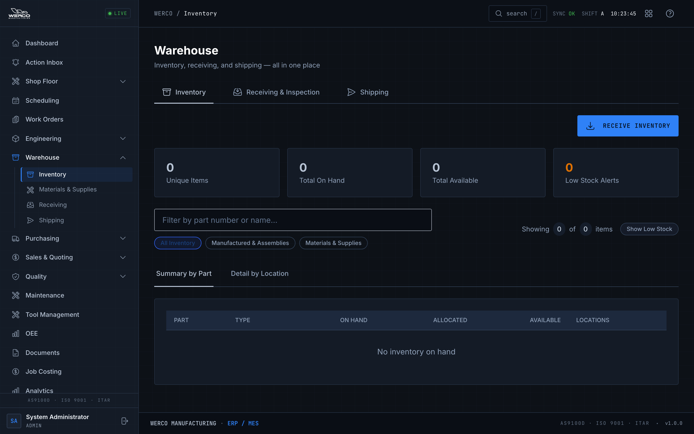
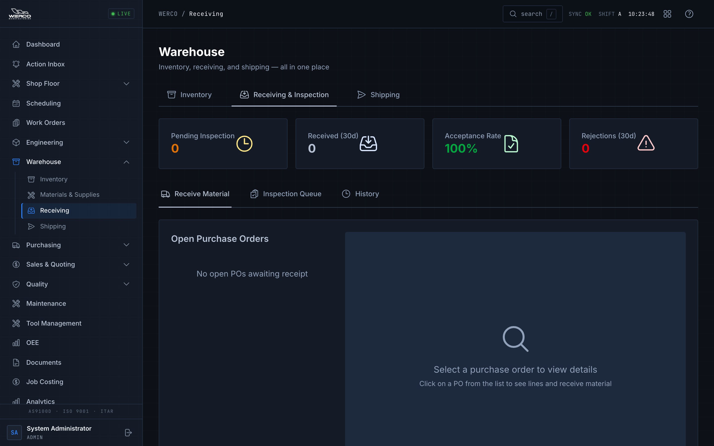
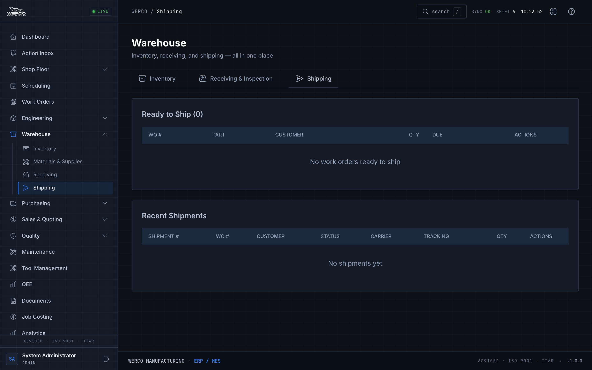

# Warehouse Guide: Receiving, Inventory & Shipping

**Who this is for:** Anyone who handles material as it comes in the door, sits on the shelf, or goes out the door — receivers, inspectors, stockroom staff, and shipping clerks.

**What you'll be able to do:**

- Find and read stock levels, and spot items that are running low.
- Move stock between locations and keep lot and serial numbers attached to it.
- Receive material against a purchase order, then inspect it (accept, reject, or both).
- Build a shipment for a finished order, mark it shipped, and print the packing slip.

> Heads up: This is an aerospace-grade quality system (AS9100D). Lot numbers, certs, and inspection results aren't paperwork for paperwork's sake — they're how we prove where every part came from. Take your time and get them right.

---

## Opening the Warehouse

Everything you need lives on one screen called **Warehouse**. Open it from the left-hand menu under **Warehouse**.

At the top you'll see three tabs. Click a tab to switch — you stay on the same screen the whole time:

- **Inventory** — what's on the shelf right now.
- **Receiving & Inspection** — material coming in against purchase orders.
- **Shipping** — finished orders going out.

> Tip: Older menu shortcuts and links named "Inventory," "Receiving," or "Shipping" still work — they just open this same Warehouse screen on the matching tab. There's nothing extra to learn.

---

## Inventory

Click the **Inventory** tab.

*The Inventory tab shows everything on hand, with low-stock items flagged in red.*

### Reading the cards at the top

Four cards summarize what you're looking at:

- **Unique Items** — how many different parts/materials are in stock.
- **Total On Hand** — the combined quantity sitting on shelves.
- **Total Available** — what's free to use (on hand minus anything already promised to a job).
- **Low Stock Alerts** — how many items have dropped to or below their reorder point.

### Finding an item

- Type in the **Filter by part number or name...** box to narrow the list.
- Use the chips below it to limit what you see: **All Inventory**, **Manufactured & Assemblies**, or **Materials & Supplies**.

### Reading stock levels

Inventory has two views, switched with the tabs just above the table:

- **Summary by Part** — one row per part, totaled across every location. Columns are **On Hand**, **Allocated** (already promised to a job), and **Available** (free to use). The location column lists every shelf the part sits on, with the quantity and lot at each.
- **Detail by Location** — one row per shelf/lot, so you can see exactly where each batch lives, its **Lot #**, quantity, and **Status**.

### Low-stock colors

- A row highlighted **red** with a **LOW STOCK** tag means that part is at or below its reorder point — time to reorder.
- The **Low Stock Alerts** card and the amber number tell you how many items are low.
- Click **Show Low Stock** (top right of the filter row) to see only the low items. Click **Showing Low Stock** again, or **Clear filter**, to go back to the full list.

> Tip: If purchasing handles reorders, you don't have to do anything about a low-stock flag except mention it — but it's good to know what's getting thin.

### Lot and serial numbers

Every batch keeps its **Lot #** (and serial, where used) attached to it. You'll see the lot in both the **Summary by Part** location list and the **Detail by Location** view. Lot tracking is how we trace a finished part all the way back to the raw material it came from, so never strip a lot off a batch.

### Adjusting / adding stock

To add stock that isn't tied to a purchase order receipt, click **Receive Inventory** (top right of the Inventory tab). Fill in:

1. **Part** — pick it from the list.
2. **Quantity** and **Location**.
3. **Lot Number** and **PO Number** if you have them.
4. **Unit Cost** if you know it.

Then click **Receive**.

> Heads up: For material arriving against a purchase order, use the **Receiving & Inspection** tab instead (next section). That path captures certs and runs the inspection step. Use **Receive Inventory** here only for stock that doesn't go through that workflow.

### Transferring between locations

To move stock from one shelf to another:

1. Switch to the **Detail by Location** view.
2. Find the row for the batch you want to move.
3. Click the transfer arrows icon in the **Actions** column.
4. In the **Transfer Inventory** box, check the part, the **From** location, and how much is **Available**.
5. Enter the **Quantity to Transfer**, pick the **To Location**, add any **Notes**.
6. Click **Transfer**.

You can't transfer more than the available quantity — the box won't let you.

---

## Receiving & Inspection

Click the **Receiving & Inspection** tab. This is a two-step job: first you **receive** the material, then you **inspect** it. Material isn't usable until inspection is done.

*Pick a purchase order on the left, then receive each line on the right.*

The stats cards across the top show **Pending Inspection**, **Received (30d)**, **Acceptance Rate**, and **Rejections (30d)** so you can see your queue at a glance.

There are three tabs inside Receiving:

- **Receive Material** — log new deliveries against a PO.
- **Inspection Queue** — items waiting for you to inspect (the badge shows how many).
- **History** — everything received in the last 30 days, including who received each delivery and when (date and time). Each row carries a status badge — **Passed**, **Failed**, or **Partial** for material that went through inspection, or a neutral **Not Required** for dock-to-stock receipts that skipped it.

### Step 1 — Receive material against a PO

1. On the **Receive Material** tab, find the delivery's PO in the **Open Purchase Orders** list on the left and click it.
2. The right panel shows the PO's lines. Each line shows **Ord** (ordered), **Recv** (already received), and **Rem** (remaining), plus a status of **Open**, **Partial**, or **Done**.
3. Find the line that matches what arrived and click its **Receive** button.
4. In the **Receive Material** box, fill in:
   - **Quantity Received** — how many actually came in (it pre-fills the remaining amount; change it to match the packing slip).
   - **Lot Number** — *required.* You cannot save without it.
   - **Heat Number** — for metals, if shown on the cert.
   - **Cert Number** — the certificate of conformance number, if you have one.
   - **Location** — where it's going on the shelf.
   - **Packing Slip #**, **Carrier**, **Tracking Number** — copy these from the shipment.
   - **Notes** — anything worth recording.
5. Check **Requires Inspection** if the material needs incoming inspection before it can be used. The box always starts **unchecked** — left unchecked, the material goes straight to inventory (dock-to-stock) and the receipt is recorded as **Not Required**. Because no inspection actually happened on that path, the receipt carries **no inspector, method, or inspection time** — it is *not* logged as a passed inspection (that keeps our records honest for an AS9100D audit). If the part's master record is flagged "Inspection Required", an amber hint appears next to the box so you can check it deliberately for this receipt. Check **CoC Attached** if a certificate of conformance came with it.
6. Click **Receive Material**.

> Heads up: **Lot Number is mandatory.** If you click Receive Material and nothing happens, look for a red message at the top — the most common cause is a missing lot number.

**Partial vs. complete receipts.** You don't have to receive a whole line at once. If only part of the order showed up, enter just what arrived. The line turns **Partial** and keeps the rest as **Rem**aining — receive the balance later when it comes in. When everything's in, the line flips to **Done**.

**Over-receipts.** If you try to receive *more* than the remaining quantity, an amber box appears asking you to check **Approve Over-Receipt** before it'll let you continue. Only do this if you genuinely received extra and it's allowed.

> Tip: Click **Receipt History** at the bottom of a selected PO to see every receipt logged against it, with lot numbers and dates.

### Step 2 — Inspect what you received

Receiving with **Requires Inspection** checked puts the material into the **Inspection Queue** — it is *not* available to use until you finish inspection. (Receipts received *without* the inspection flag skip this step and go straight to inventory.)

1. Go to the **Inspection Queue** tab. Each row shows the receipt, PO/vendor, part, quantity, lot, whether a **CoC** is attached, and how many **Days** it's been waiting (rows turn amber/red when they sit too long).
2. Click **Inspect** on the row you're working.
3. The **Inspect Receipt** box shows the receipt details up top. Then enter:
   - **Quantity Accepted** and **Quantity Rejected** — these two are linked, so when you type one the other fills in automatically. Together they can't add up to more than the quantity received.
   - **Inspection Method** — how you checked it (Visual, Dimensional, Functional, etc.).
4. **If you're rejecting any quantity**, two more fields become required:
   - **Defect Type** — pick the closest match (Dimensional, Cosmetic, Material, Documentation, and so on).
   - **Inspection Notes** — describe the non-conformance. This is required for rejects.
5. The **Inspection Result Preview** at the bottom tells you what will happen:
   - **Full Pass** — all of it goes into inventory.
   - **Full Reject** — none goes in; an NCR (quality issue) is created.
   - **Partial** — accepted units go to inventory, rejected units go to an NCR.
6. Click **Complete Inspection**.

> Heads up: Rejecting material automatically raises an **NCR** (Non-Conformance Report) and routes the rejected quantity to quarantine — you don't create it by hand. The confirmation message tells you the NCR number. That's the quality team's signal to take over, so make your notes clear.

Once inspection is complete, accepted material shows up on the **Inventory** tab, ready to use.

---

## Shipping

Click the **Shipping** tab. Use this when a work order is finished and the parts are ready to go to the customer.

*Finished work orders appear in Ready to Ship; build a shipment, mark it shipped, then print the slip.*

The screen has two lists:

- **Ready to Ship** — finished work orders waiting to go out.
- **Recent Shipments** — shipments you've already started or sent.

### Create a shipment

1. In the **Ready to Ship** list, find the order. Each row shows the **WO #**, part, customer, finished **Qty**, and **Due** date.
2. Click **Create Shipment** on that row.
3. In the **Create Shipment** box, fill in:
   - **Ship To** — pre-filled with the customer name; adjust if needed.
   - **Carrier** — pick from UPS, FedEx, USPS, Freight, or Customer Pickup.
   - **Qty to Ship** — defaults to the full finished quantity; lower it if you're shipping a partial.
   - **Weight (lbs)** and **# Packages**.
   - **Include Certificate of Conformance** — leave checked when the customer needs a CoC (the usual case).
   - **Packing Notes** — anything the customer or carrier should know.
4. Click **Create Shipment**.

The new shipment appears in **Recent Shipments** with a **pending** status.

> Tip: "Picking the right lots" happens through the work order itself — the parts you finished are tied to the lots that went into them, so the shipment carries that traceability automatically. Just confirm the **WO #** and quantity match what you're physically boxing.

### Mark it shipped

1. In **Recent Shipments**, find your pending shipment.
2. Click **Ship** in the **Actions** column.
3. When prompted, enter the **tracking number** (or leave it blank if there isn't one) and confirm.

The status changes to **shipped**.

### Print the packing slip

In the **Recent Shipments** row, click the **printer icon** in the **Actions** column. The packing slip opens in a new tab, ready to print and put in the box.

> Tip: You can print the packing slip before or after marking it shipped — the printer icon is always available on the row.

---

## Scanning

Where your station has a barcode/QR scanner, you can scan a lot or serial label instead of typing it. Click into the **Lot Number** (or serial) field first so the cursor is blinking there, then scan — the code drops straight into the box. This is the fastest, most error-proof way to capture a lot during receiving.

> Tip: If a scan lands in the wrong field, the cursor was somewhere else. Clear it, click the field you actually want, and scan again. If a label won't scan at all, type the number by hand and let your supervisor know the label is bad.

---

## Common problems

| Symptom | What to do |
| --- | --- |
| "Receive Material" does nothing | Look for a red message at the top. Almost always it's a missing **Lot Number** — it's required on every receipt. |
| It won't let me receive the quantity I have | You're entering more than the line's remaining amount. Either lower the quantity, or check **Approve Over-Receipt** if you truly received extra. |
| Inspection won't complete | Check three things: **Accepted + Rejected** can't be more than the received quantity; and if you rejected any, both **Defect Type** and **Inspection Notes** are required. |
| Material I received isn't on the shelf yet | If it was received with **Requires Inspection** checked, it's still in the **Inspection Queue** — it only reaches Inventory after you finish inspection and accept it. |
| There's no **Inspect** button on a queue row | Completing inspections is limited to certain roles (Administrator, Manager, Supervisor, Quality). If you don't have one of those, hand the receipt to someone who does. |
| I can't transfer as much as I want | The box caps you at the **Available** quantity for that batch. Some of it may be allocated to a job. |
| No work orders show in "Ready to Ship" | Only finished work orders appear here. If one's missing, it isn't marked complete yet — check with the shop floor or your supervisor. |
| A low-stock part isn't getting reordered | The red **LOW STOCK** flag is a heads-up, not an order. Let purchasing know, or raise it with your supervisor. |
| A lot/serial label won't scan | Type the number by hand to keep moving, and report the bad label so it can be reprinted. |

## Where to get help

Ask your supervisor first. For account or login problems, or anything that looks broken in the system, contact your administrator or IT. New to a term like **lot**, **CoC**, **NCR**, or **traceability**? Check the **[Glossary](./glossary.md)**.

---

## Try it

A short end-to-end drill. Use a training PO and work order if you have them — ask your supervisor.

1. Open **Warehouse** and click the **Receiving & Inspection** tab.
2. On **Receive Material**, click a PO, then click **Receive** on one of its lines.
3. Enter a **Quantity Received**, a **Lot Number**, pick a **Location**, make sure **Requires Inspection** is checked, and click **Receive Material**.
4. Go to the **Inspection Queue** tab and click **Inspect** on the receipt you just made.
5. Accept all of it (full pass), pick an **Inspection Method**, and click **Complete Inspection**.
6. Click the **Inventory** tab and confirm your quantity now shows up under that part and lot.
7. Switch to the **Shipping** tab. In **Ready to Ship**, click **Create Shipment** on a finished order, fill in the carrier and quantity, and click **Create Shipment**.
8. In **Recent Shipments**, click **Ship**, enter a tracking number, then click the **printer icon** to print the packing slip.

If every step worked, you've done the full warehouse loop: in the door, on the shelf, and out the door.
