# Planner, Supervisor & Manager Guide

**Who this is for**

Planners, buyers, supervisors, shop managers, and quality leads — anyone who sets up the work, decides what runs next, keeps materials flowing, and watches the numbers. If you create work orders, schedule jobs, buy material, or sign off on quality, this guide is for you.

**What you'll be able to do**

- Run a daily opening check across the Dashboard, schedule, shop floor, and your queues.
- Set up the data a job needs to run: parts, BOMs, and routings.
- Create, release, and complete work orders, and print travelers.
- Schedule and dispatch jobs, set priority (with a reason on the record), and rebalance overloaded machines.
- Create purchase orders, send them to vendors, and run MRP to catch shortages.
- Turn customer RFQs into quotes and quotes into work orders.
- Oversee quality: NCRs, CARs, FAIs, calibration, traceability, and complaints.
- Read the analytics and reports that tell you how the shop is doing.

> Tip: Read **01 — Getting Started** first if you haven't. It covers signing in, the side menu, the Dashboard, and search — this guide assumes you know those.

---

## Daily opening checklist

Start your shift with a five-minute sweep. It tells you what's late, what's blocked, and where the pinch points are before the floor gets busy.

1. Open the **Dashboard** (the home `/` screen).
   - **What you'll see:** alert banners for overdue work orders, open NCRs, calibration due, and low stock; KPI cards including **Overdue**, **Due Today**, and **Active Work Orders**; and a capacity heatmap per work center (green is healthy, amber is busy, red is over capacity).
   - Note anything red or overdue — that's your first work of the day.

   
   *The Dashboard gives you the shop at a glance the moment you sign in.*

2. Open **Scheduling** (in the side menu).
   - **What you'll see:** a stats strip across the top — **Unscheduled**, **Scheduled**, **Overdue**, **Overloaded WCs**, and **Hours Remaining**.
   - Check the **Unscheduled** count (jobs waiting for a slot) and **Overloaded WCs** (work centers booked past capacity). The **Dispatch Queue** lower down shows the most urgent jobs at the top.

3. Open **Shop Floor** (under the Shop Floor menu) or watch the Dashboard's live activity.
   - Confirm what's running and look for anything on hold or blocked.

4. Clear your inbound and quality queues.
   - In the **Warehouse** screen, open the **Receiving** tab and check the **inspection queue** for material waiting to be accepted.
   - In **Quality**, scan the **NCR**, **CAR**, and **FAI** tabs for open items that need attention.

> Heads up: Overdue and blocked work won't fix itself. If a job is blocked, open it and check its **Blockers** panel (see "Creating & releasing work orders" below) so the reason is on the record.

---

## Engineering data: Parts → BOM → Routing

A job can only run if the part is set up properly. The order is always the same: **the part exists → it has a released BOM (if it's an assembly) → it has a released routing**. Get these right and work orders auto-fill themselves.

### Create a part

1. Open **Parts** (under Engineering) and click **Add Part** (or press **Ctrl+N**).
2. Fill in the part number, name, type (for example manufactured or assembly), and any customer part number.
3. Save. You can open any part from the list to see its detail, BOM, and routing.

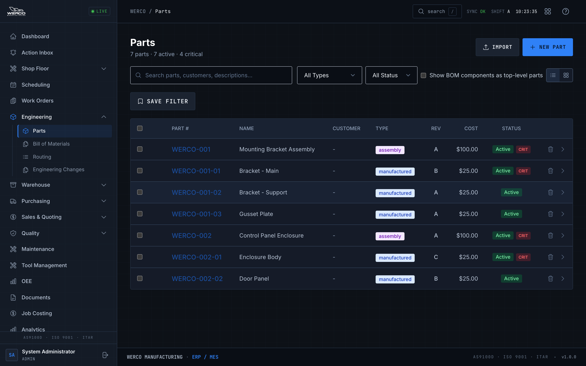
*The Parts list is the master catalog — everything you build or buy starts here.*

### Build and release a BOM

A BOM (bill of materials) is the recipe — the components and quantities that go into an assembly.

1. Open **BOM** (under Engineering).
2. Create a BOM for the assembly part, then add line items (component part + quantity).
3. **Importing instead?** Use the import option, choose your file, and **preview** the result before you commit. The preview shows you exactly what will be added so you can catch mistakes; you can optionally auto-create any missing component parts during import.
4. When the recipe is correct, **Release** the BOM revision so work orders can use it.

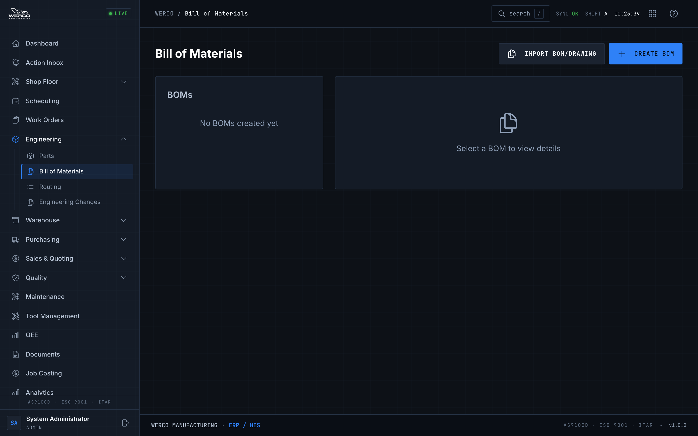
*Release a BOM only when it's right — released BOMs feed straight into work orders.*

> Heads up: Editing a released BOM means making a new revision, not quietly changing the old one. This preserves the history that audits depend on.

### Build and release a routing

A routing is the sequence of operations — the steps, the work center each runs on, and how long setup and run take.

1. Open **Routing** (under Engineering) and create a routing for the part.
2. Add operations in order. For each, set the **operation name**, the **work center**, and the **setup** and **run** times.
3. Review the sequence, then **Release** the routing so it's available for production.

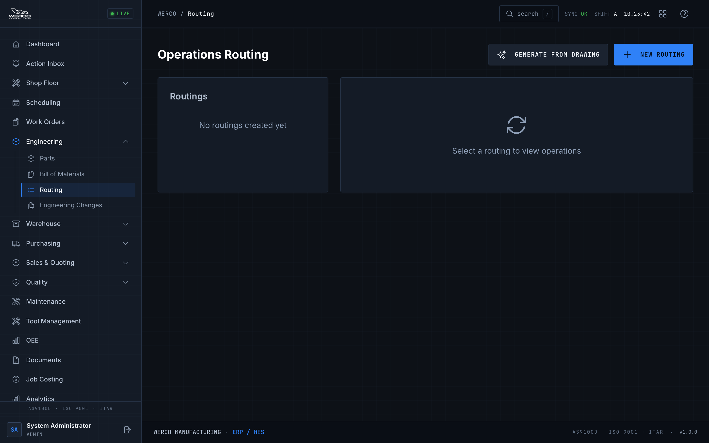
*A released routing is what makes a work order's operations appear automatically.*

---

## Creating & releasing work orders

A work order is one job: build this part, this quantity, by this date. If the part has a released routing (or, for assemblies, released component routings), the operations fill in for you.

### Create a new work order

1. Open **Work Orders** and click **New Work Order** (top right of the list).
2. **Part \*** — start typing in the **Search parts, assemblies, or BOM components** box and pick from the list. Only manufactured parts and assemblies appear here.
   - **What you'll see:** once you pick a part, a readiness panel tells you either "Selected part is ready for a work order" (green) or lists what's missing.
3. **Quantity \*** — enter how many to build.
4. **Priority** — choose from **1 - Critical**, **2 - Urgent**, **3 - High**, **5 - Normal**, **7 - Low**, or **10 - Lowest**. (Priority runs 1–10, where 1 is the most urgent.)
5. **Customer Name** — type to search existing customers and pick one, or type a new name and click **Create "…"** to add it on the spot.
6. **Customer PO #** and **Due Date** — fill in if you have them.
7. **Operations** — review the auto-filled steps. You'll see a green banner like "Auto-populated from routing Rev …" or "Auto-populated from BOM component routings." You can edit setup/run minutes or work centers; rows you change turn yellow. If there's no released routing, you'll get a prompt to **Add operations manually**.
8. Click **Create Work Order**. You'll land on the work order's detail page.

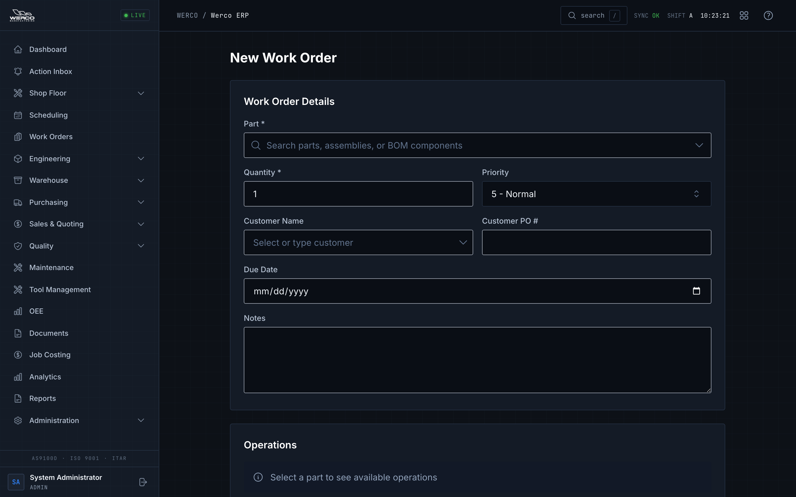
*Pick a part with a released routing and the operations fill themselves in.*

> Tip: If the readiness panel blocks you, the part isn't ready (usually no released routing or BOM). Fix the engineering data first — see the section above.

### Release, start, complete, and print

On the **work order detail** page, the action buttons in the top-right change with the job's status:

1. **Release** — turns a draft into a released job so it's available on the floor and in scheduling.
2. **Start** — moves a released job into progress.
3. **Complete** — finishes the job; you'll be asked for the quantity completed and quantity scrapped.
4. **Print Traveler** — opens the printable traveler that goes out to the floor with the job.

The detail page also shows the work order's quantities, due date, priority, customer, material requirements, operation progress, attached drawing PDFs, and a **Blockers** panel where you (or an operator) can **Report Blocker** — pick the operation, a category (material missing, machine down, tooling missing, quality hold, and so on), and a severity. Open blockers can be marked **Resolve** with a note when cleared.

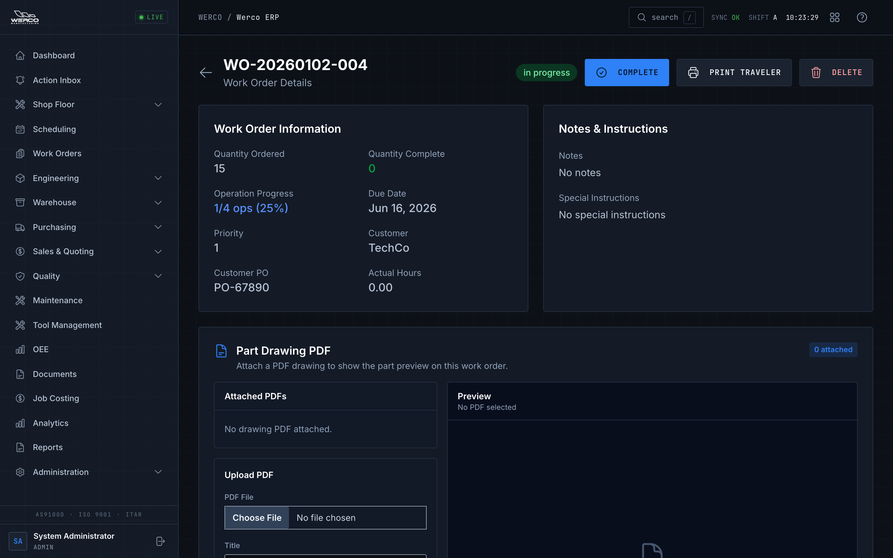
*Everything about one job lives here — release it, run it, print the traveler, and clear blockers.*

You can also browse and filter every job from the **Work Orders** list.

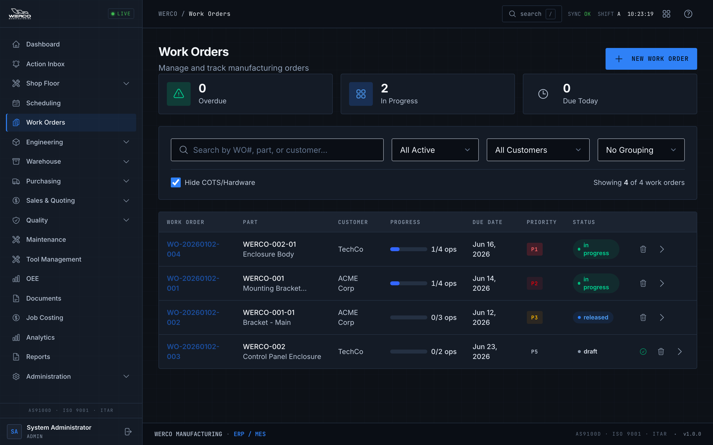
*Filter the Work Orders list to find drafts to release or jobs to check on.*

---

## Scheduling & dispatch

The **Scheduling** screen (titled **Production Schedule**) is where you decide what runs where and when. It has three parts: the **Machine Capacity** overview, the weekly board, and the **Dispatch Queue**.

### Read the board

- The **Machine Capacity** cards show each work center's weekly load with a Mon–Sat strip of daily chips. Colors run green (open) → yellow (70%+) → amber (90%+) → red (over capacity).
- The weekly board lays out scheduled jobs by work center across the days. The stats strip up top counts **Unscheduled**, **Scheduled**, **Overdue**, **Overloaded WCs**, and **Hours Remaining**.
- Use the **Today** button and the arrows to move between weeks.

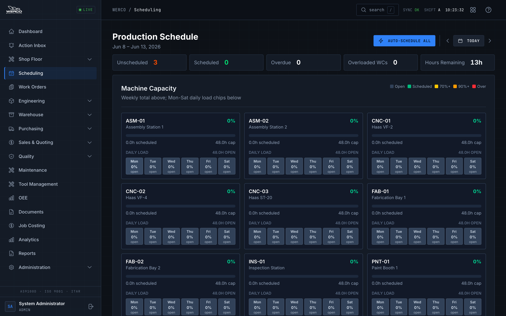
*Drag jobs across the grid; the capacity chips warn you before you overload a machine.*

### Schedule and move work

1. **Drag a job card** to a different day or work center to reschedule or reassign it. Drop it on a date cell to schedule it there, or on a work-center row header to move it to that machine.
2. **Click a job** to open the schedule dialog, then pick a start date and work center and confirm.
3. **Earliest** — use this to drop a job into the soonest available slot in one click.
4. **Auto-Schedule All** — places every unscheduled job into its earliest available capacity at once.

### Prioritize and bulk-edit from the Dispatch Queue

The **Dispatch Queue** sorts jobs by an urgency score so the most important work is at the top. From here you can:

1. **Set priority** per job (1–10). When you change priority you can enter an optional **Priority reason** — that reason is saved with the change, which keeps the record clear for traceability.
2. Use the **Bulk** panel to select several jobs and **Apply** a priority, **Move** them to another work center, **Shift Dates** by a number of days, or **Schedule Selected Earliest**.
3. Search by WO# or part, and filter by work center, to focus the list.

> Tip: When a capacity chip is red (over 100%), the machine is overbooked that day. Drag a job off it, shift its dates, or move it to another work center to rebalance before the day arrives.

---

## Purchasing & MRP

### Create a vendor and a purchase order

1. Open **Purchase Orders** (the **Purchasing & Receiving** screen). It has two tabs: **Purchase Orders** and **Vendors**.
2. To add a supplier, click **New Vendor**, fill in the code, name, and terms, then **Create Vendor**.
3. To raise a PO, click **New PO**, choose the vendor, add part lines with quantities and unit prices, then **Create PO**.
4. On a draft PO in the list, click **Send** to send it to the vendor (you'll be asked to confirm).

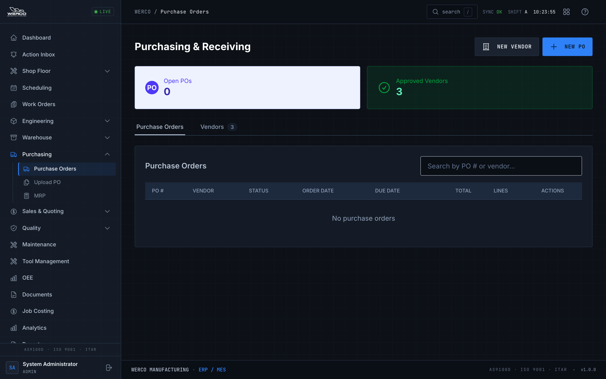
*Create vendors and POs here, then send the PO when it's ready.*

> Heads up: To actually receive material and run receiving inspection, use the **Receiving** tab in the **Warehouse** screen — that's covered in the Warehouse guide. Purchasing is where the order is created and sent.

### Run MRP to find shortages

MRP (material requirements planning) compares what you need to build against what's on hand and flags shortages.

1. Open **MRP** (the **Material Requirements Planning** screen).
2. In the **Run MRP** panel, click **Run MRP**.
3. **What you'll see:** a **Material Shortages** summary with totals (including how many need expediting), recommended actions, and a list of recent runs.
4. Review the recommended actions and click **Process** on the ones you want to act on — this is how shortages turn into suggested purchase orders.

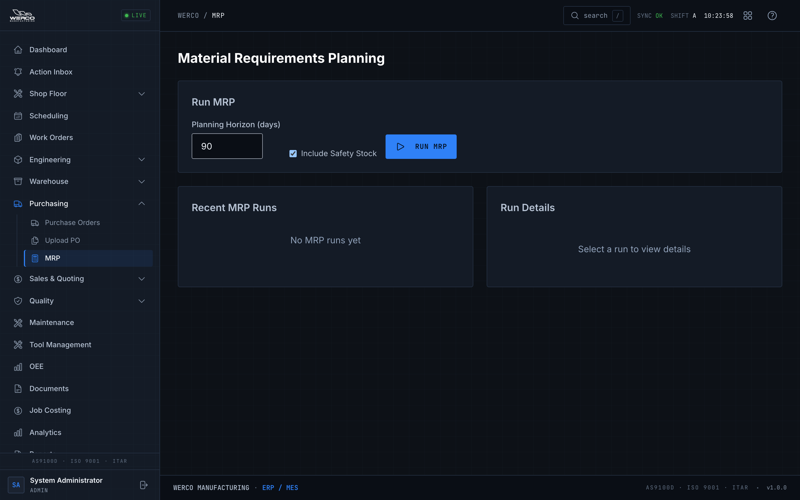
*Run MRP to catch shortages early and generate the POs that cover them.*

### Upload a PO or quote PDF

If a customer or vendor sends a PDF, use **Upload PO** (in the menu) to upload it. The system reads the document, you review the extracted fields, match parts and vendors, and create the purchase order from the upload.

---

## Quoting & customers (overview)

Quoting is how new work gets priced before it becomes a job. There are two paths, plus customer records.

- **AI RFQ Quote** (**New RFQ Package**) — the AI-assisted path. Pick or create a customer, set the RFQ reference, target margin, and how many days the quote is valid, then upload the drawings (PDF, DXF, or STEP). The system reads the drawings, identifies the parts, and estimates cost and lead time with a confidence level and the assumptions it made. You review the line items and confirm to create the quote.

  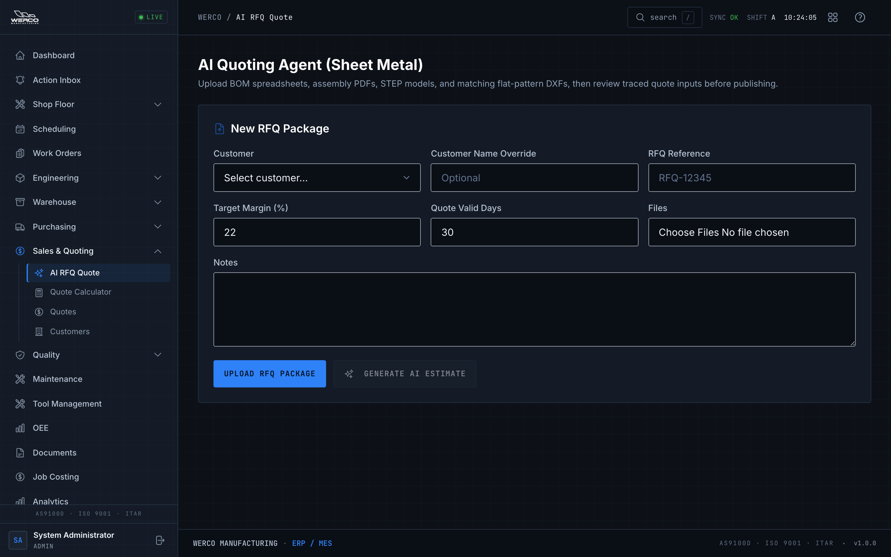
  *Upload the customer's drawings and the AI drafts the estimate for you to review.*

- **Quote Calculator** — the manual path for CNC or sheet-metal quotes. Enter the inputs (you can upload a DXF for geometry analysis), and it uses your materials and finishes defaults to price the job. You can create a quote from the result.

- **Quotes** — the list of quotes. Create a quote, send it to the customer, and when it's approved, **convert** it into a work order.

- **Customers** — create and update customer records and review their stats and associated activity.

---

## Quality oversight

Quality records are correctness requirements here, not paperwork. Everything is tracked and time-stamped.

1. **Quality** (the **Quality Management** screen) has three tabs:
   - **NCR** (Non-Conformance Reports) — raised when a part or material doesn't meet the requirement. Click **New NCR** to open one.
   - **CAR** (Corrective Action Requests) — opened to fix the root cause of a recurring or serious problem. Click **New CAR**.
   - **FAI** (First Article Inspections) — a full documented inspection of the first piece off a new or changed job. Click **New FAI**.
   - Summary cards across the top show open NCRs, open CARs, and pending FAIs.

   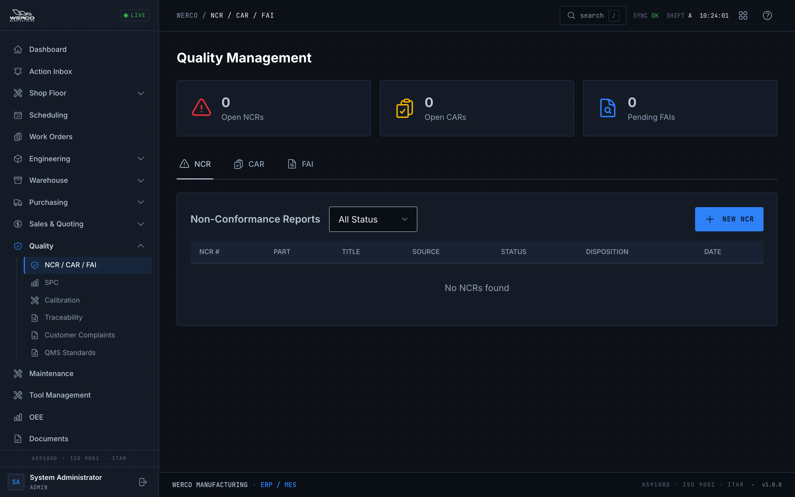
   *Track NCRs, CARs, and FAIs from one screen — open counts are right at the top.*

2. **Calibration** — register measuring equipment, track due dates and status, and record calibration events.
3. **Traceability** — search by lot or serial number and trace a lot's genealogy and where-used history.
4. **Customer Complaints** — log and manage complaints from customers.
5. **QMS Standards** — your quality-management standards reference.

---

## Analytics & reports

When you want the numbers behind the floor:

1. **Analytics** opens to the **Analytics Dashboard** with real-time KPI cards — OEE, on-time delivery, first-pass yield, scrap rate, open NCRs, quote win rate, backlog hours, and inventory turnover — plus production trends. Use the period selector (**Today**, **7 Days**, **30 Days**, **90 Days**, **Year to Date**) to change the window.
2. Switch to focused views for **Production**, **Quality**, **Inventory**, **Forecasting** (capacity outlook and inventory risk), and **Cost** analytics, plus **Custom Reports**.

   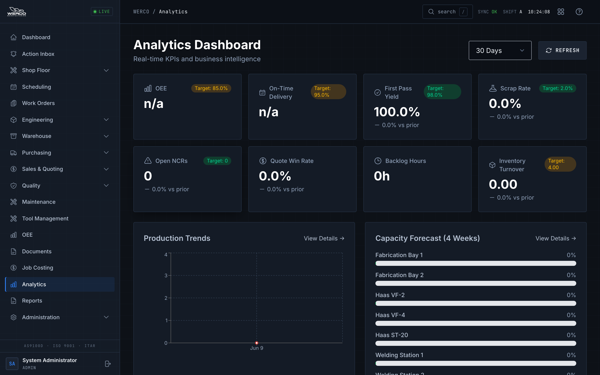
   *The Analytics dashboard is the shop's scoreboard — switch views for the detail behind each number.*

3. **Reports** holds the standard report set, including daily output, work-center utilization, work-order costing, production summary, quality metrics, vendor performance, inventory value, and employee time.
4. **Job Costing** breaks down cost by job.

---

## Common problems

| Symptom | What to do |
|---|---|
| A work order won't release | Make sure it has operations and that the routing (and BOM, for assemblies) is **released**. A part with no released routing can't release a clean work order. |
| A job won't schedule | Confirm the job's current operation has a **work center** assigned and the work order is active (released or in progress). Unassigned operations can't land on the board. |
| Setting priority fails | Check that you have permission to edit work orders, and that the priority is a number from **1 to 10**. |
| A part won't appear in the New Work Order search | Only manufactured parts and assemblies show there. Check the part type, and make sure the part is active. |
| The readiness panel blocks the work order | It's telling you what's missing (usually a released routing or BOM). Fix the engineering data, or add the operations manually if appropriate. |
| A machine shows red on the capacity heatmap | It's booked past capacity for that day. Drag a job off it, shift dates, or move work to another work center to rebalance. |
| Receiving inspection won't complete | Confirm the accepted and rejected quantities are valid and that any required reject notes are filled in (see the Warehouse guide). |

## Where to get help

Ask your supervisor first. For account, permission, or setup issues, contact your administrator or IT. For plain-language definitions of terms like **BOM**, **routing**, **MRP**, **NCR**, **CAR**, **FAI**, and **OEE**, see the **[Glossary](./glossary.md)**.

---

## Try it (end-to-end)

Run a full job through the system so you've touched every step at least once. Use a test customer and part so you don't disturb live work.

1. **Customer** — in **Customers**, create a test customer (for example "Training Co").
2. **Part** — in **Parts**, create a manufactured test part.
3. **BOM** — in **BOM**, build a simple BOM for it (if it's an assembly) and **Release** it.
4. **Routing** — in **Routing**, add a couple of operations with work centers and times, then **Release** it.
5. **Work order** — open **Work Orders**, click **New Work Order**, pick your part, set a quantity, a due date, and your test customer, confirm the operations auto-filled, and click **Create Work Order**. Then **Release** it on the detail page.
6. **Schedule** — in **Scheduling**, find the job in the **Dispatch Queue** and click **Earliest** to slot it in.
7. **Priority with a reason** — raise its priority (for example to **2 - Urgent**) and type a short **Priority reason**.
8. **Run it** — have it started and completed on the **Shop Floor** kiosk, recording quantity produced and any scrap (see the Operator guide).
9. **Ship it** — in the **Warehouse** screen's **Shipping** tab, create the shipment, mark it shipped, and print the packing slip (see the Warehouse guide).
10. **Verify** — open the **Audit Log** and confirm you can see the entries for the work order release, the priority change (with your reason), the completion, and the shipment.

You've now followed a job from a blank customer record all the way to a shipped order — and confirmed the system recorded every step.
