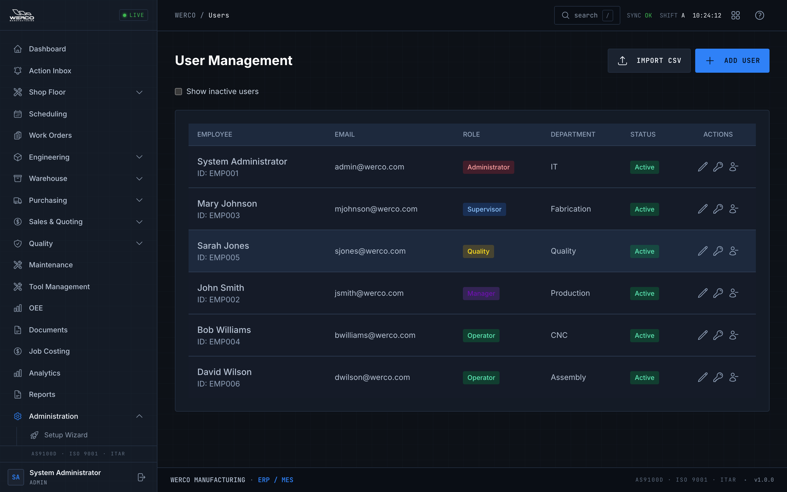
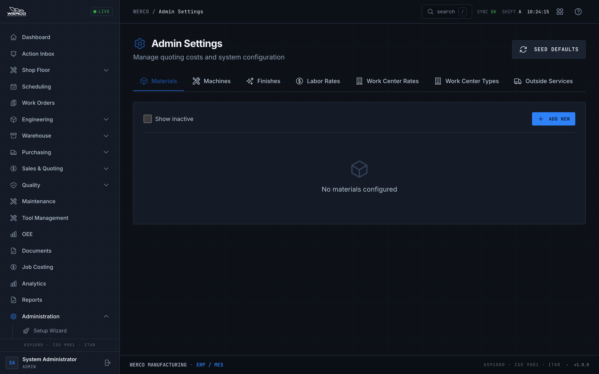
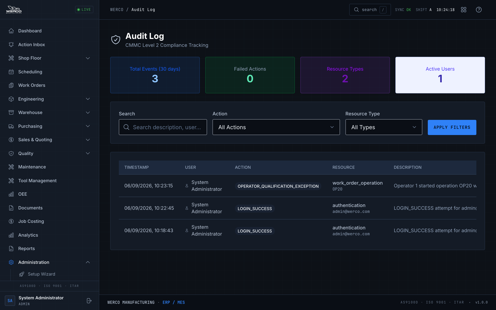

# Administrator & IT Guide

**Who this is for:** People who set up and run the Werco ERP-MES behind the scenes — administrators and IT staff. You create user accounts, configure the system, and keep the records clean and auditable.

**What you'll be able to do:** Add and manage users, assign roles, set up work centers and cost settings, load starter data in bulk, provision shop-floor badge logins, and read the audit log when an auditor or a customer asks "who changed this, and when?"

> Heads up: Most of what you do here changes other people's access or the numbers behind quotes and costs. Take your time. Most operational changes across the system are recorded in the audit log — but note that user-management actions on the Users screen (create, edit, activate/deactivate, role change, password reset) are **not** currently audited. See [Security & compliance](#security--compliance-what-to-tell-auditors).

---

## Managing users

Go to **Users** (under **Administration**) to see everyone in your company.

*The User Management screen lists every account, its role, and its status.*

### Create a user
1. Click **Add User** (top right).
2. Fill in **First Name**, **Last Name**, **Employee ID**, and **Email**.
3. Enter a **Password**. It must meet the rules shown under the field: at least 12 characters, upper and lowercase letters, at least one number, at least one special character, and no common words like "password", "admin", or "welcome".
4. Pick a **Role** (see [Roles & permissions](#roles--permissions) below) and optionally a **Department**.
5. Click **Create**.

> Tip: For shop-floor operators who sign in with a badge instead of a password, use the **Employees** tab in Admin Settings instead — it sets up the 4-digit login for you. See [Admin Settings](#admin-settings).

### Edit a user
1. Find the person in the table.
2. Click the **pencil** icon in the **Actions** column.
3. Change their name, email, role, or department, then click **Update**.

> Heads up: You can't change someone's Employee ID after the account is created.

### Reset a password
1. Click the **key** icon next to the user.
2. Enter a **New Password** that meets the same rules.
3. Click **Reset Password**. Tell the user their new password through a private channel — never email it in plain text.

### Activate or deactivate an account
1. Click the **person** icon next to the user (a minus icon deactivates, a plus icon reactivates).
2. Deactivated users keep all their history but can no longer sign in. Use this instead of deleting people who have left — it preserves the audit trail.

> Tip: Check **Show inactive users** at the top of the table to see deactivated accounts.

### Approve pending self-registrations
When someone registers their own account, it stays inactive until you approve it.
1. If accounts are waiting, you'll see a **Pending (N)** button and a yellow **Pending Account Approvals** panel.
2. For each pending person, choose the **role** to grant from the dropdown.
3. Click **Approve**.

### Import many users at once
Use **Import CSV** on the Users screen, or the **Import Center**, to load a whole roster at once. See [First-time setup & bulk import](#first-time-setup--bulk-import).

---

## Roles & permissions

Every account has exactly one **role**. The role decides what the person can do. There are eight roles:

| Role | What it's for |
|------|---------------|
| **Platform Admin** | Werco oversight only. Can view other companies read-only and switch between them. |
| **Administrator** | Full access for one company, including Admin Settings. Day-to-day system owner. |
| **Manager** | Broad operational control and approvals, but no admin-only settings. |
| **Supervisor** | Shop execution and planning, with limited user/admin controls. |
| **Operator** | Executes work only (start, hold, complete jobs). Usually signs in at the kiosk. |
| **Quality** | Inspections and quality approvals (NCR/CAR/FAI, calibration). |
| **Shipping** | Shipping operations (create shipments, mark shipped). |
| **View Only** | Read-only — for auditors, executives, and guests. |

### How access actually works
The system follows a simple rule: **read broad, write restricted.**
- **Doing things** — creating, editing, deleting, releasing, approving, shipping — is locked to the right roles. The server enforces this; the screen also hides buttons you can't use.
- **Looking at operational screens** — work orders, parts, BOMs, routings, inventory, purchasing, receiving, shipping, quality — is open to anyone signed in to your company. Everyone sees the same shop, but only the right roles can change it.
- **Admin areas are the exception** — **Users**, **Admin Settings**, and the **Audit Log** are restricted, and not all to the same roles:
  - **Users** and the **Audit Log** are open to **Administrators and Managers**.
  - **Admin Settings** is **Administrator-only**.
  - **Supervisors, Operators, Quality, Shipping, and Viewers** can't open any of these three.

All data is walled off by company. A user in one company can never see another company's records (the only exception is a Platform Admin viewing read-only — see [Platform admin: switching companies](#platform-admin-switching-companies)).

> Tip: The full role-by-action breakdown — which role can create a work order, release a BOM, inspect a receipt, and so on — lives in [../RBAC_PERMISSIONS.md](../RBAC_PERMISSIONS.md). Point auditors there.

You can fine-tune what each role is allowed to do on the **Roles & Permissions** tab in Admin Settings, and reset any role back to its defaults. See [Admin Settings](#admin-settings).

---

## Work centers

A work center is a machine or station where work happens (a laser, a press brake, a weld booth, inspection, shipping). Go to **Work Centers** (under **Administration**).

### Create a work center
1. Click **Add Work Center**.
2. Enter a **Code** (short, e.g. `LAS-01`) and pick a **Type**.
3. Enter a **Name**, and optionally a **Description**.
4. Set the **Hourly Rate ($)** and **Capacity (hrs/day)** — these feed scheduling and costing.
5. Optionally set **Building** and **Area** for location.
6. Click **Create**.

> Heads up: You can't change a work center's **Code** after it's created — pick it carefully.

### Edit a work center
Click the **pencil** icon on the work center's card, change the details, and click **Update**.

### Set a work center's status
Each card has a status dropdown. Pick one:
- **Available** — ready to run.
- **In Use** — currently running a job.
- **Maintenance** — down for planned service.
- **Offline** — out of service.

Status updates immediately and shows as a colored dot on the card and on the Dashboard capacity view.

> Tip: The list of work center **Types** (and which types appear in the dropdown) is managed on the **Work Center Types** tab in Admin Settings.

---

## Admin Settings

Go to **Admin Settings** (under **Administration**). This is the configuration hub for quoting costs and system behavior. It's admin-only. Across the top are tabs.

*Admin Settings groups all configuration into tabs across the top.*

Most tabs work the same way: a **Show inactive** checkbox, an **Add New** button, and a table where you **edit** (pencil) or **deactivate** (trash) each row. Deactivating hides a row from new quotes without deleting its history.

- **Materials** — your material library for quoting and costing (price per cubic inch / per pound, density, machinability, markup %).
- **Machines** — machine hourly rates, setup rates, and typical setup hours.
- **Finishes** — outside finishing options with per-part / per-sq-ft cost, minimum charge, and added lead days.
- **Labor Rates** — default labor cost by role (e.g. Welder, Machinist, Assembler).
- **Work Center Rates** — the editable hourly-rate table for your existing work centers (edit only — create work centers on the Work Centers page).
- **Work Center Types** — the master list of work center types. Add a type by typing it and clicking **Add Type**; it's normalized to lowercase with underscores. A type that's already in use by a work center is locked and can't be removed.
- **Outside Services** — vendor processes (plating, heat treat, etc.) with cost, cost unit, minimum charge, and lead days.
- **Overhead/Markup** — global quote settings: **Default Markup %**, **Minimum Order Charge**, **Rush Multiplier**, **Standard Lead Days**, **Quantity Breaks**, and **Tolerance Surcharges**. Click the pencil to edit a value.
- **Employees** — provision **4-digit operator badge logins** for the shop floor. Click **Add Employee**, enter first/last name and a **4-digit Employee ID** (short numbers are padded with zeros, e.g. 7 becomes 0007), and Save. This creates an operator account the worker signs into at the kiosk using just that ID — no password to remember. You can edit a name/department or deactivate a badge here too.
- **Roles & Permissions** — pick a role, check or uncheck the permissions it has by category, and click **Save Changes**. **Reset to Default** restores that role's standard permissions. Use this carefully; it changes what everyone in that role can do.
- **Audit Log** — the settings-change history (who changed which setting, old value, new value, when).

> Tip: The **Seed Defaults** button (top right) loads a sensible starter set of labor rates, outside services, and quote defaults — handy on a brand-new setup.

---

## First-time setup & bulk import

### Setup Wizard
Go to **Setup Wizard** (under **Administration**) to load the minimum data needed to run a clean first job.
- An **Onboarding Progress** bar and **Continue Setup** button walk you to the next missing step.
- The numbered steps cover: Employees, Work Centers, Parts, BOMs, Routings, and your first Work Order. Each step links straight to where you do it.
- **Master Data Health** flags blocking issues (like assemblies missing a released BOM) so you can fix them before release.

Click **Refresh** anytime to recheck progress.

### Import Center
Go to **Import Center** (under **Administration**) to load data from spreadsheets — Excel (`.xlsx`) or CSV. Pick a data type from the left list:
- **Employees / Users**, **Parts**, **Materials & Supplies**, **Customers**, **Vendors**, **Work Centers**, **Open Work Orders**, and **Open Purchase Orders** import directly on this page.
- **Routings**, **BOMs**, and **Inventory** use their own module pages (the Import Center links you there). For **Routings**, open the **Routing** page and click **Import Routings** to dry-run and commit; the Import Center's Routings tab provides the template and column hints.

For each type:
1. Click **Download template (.xlsx)** for a correctly formatted Excel template. The grey row under the headers is guidance (it's skipped automatically on import), and an **Examples** sheet shows filled-in rows (that sheet is never imported).
2. Fill in the **Import** sheet, keeping the column headers.
3. Choose your file and click **Validate file (dry run)**. Nothing is written yet — you get a preview of how many rows **would** be created, plus a per-row error table.
4. Fix any errors and validate again until clean, then click **Commit import**. Rows with errors are skipped and reported; good rows are created.

> Tip: For employees, operators can be imported without an email or password (they'll use badge login). Non-operators need a password in the row, or set a **Default Password** for the whole import.

> Moving the whole shop off Excel for go-live? Follow the step-by-step load order, rehearsal plan, and cutover checklist in the [Excel migration runbook](../EXCEL_MIGRATION_RUNBOOK.md).

---

## Custom fields

Go to **Custom Fields** (under **Administration**) to add your own fields to different areas of the system when the standard fields aren't enough.
1. Define a field for a chosen area/resource.
2. Set its **type** and whether it's **required** and **active**.
3. Edit or retire fields you no longer need.

Keep custom fields to what you'll actually use — every extra required field is one more thing the shop has to fill in.

---

## The audit log

Go to **Audit Log** (under **Administration**). This is the tamper-evident record of changes across the system — labeled **CMMC Level 2 Compliance Tracking** at the top. It's your answer to "who did what, when?"

*The Audit Log shows every recorded action, who performed it, and the before/after values.*

At the top, summary cards show **Total Events (30 days)**, **Failed Actions**, the number of **Resource Types** touched, and **Active Users**.

### Find a specific change
1. Use **Search** to look up a description or user.
2. Filter by **Action** (Create, Update, Delete, Login, etc.) and by **Resource Type** (work order, part, shipment, and so on).
3. Click **Apply Filters**.
4. Click any row to open the detail, including the timestamp, user, IP address, and the **Previous Values** / **New Values** for the change.

Use this for internal audits, customer audits, and incident response. Because operational state changes are recorded, you can reconstruct what happened to a job, a part, or a shipment. (See the audit-coverage note under [Security & compliance](#security--compliance-what-to-tell-auditors) for what isn't captured yet.)

> Heads up: The audit log is read-only by design and protected by a tamper-evident hash chain. No one — not even an administrator — edits or deletes entries from the app. That's what makes it trustworthy in an audit.

---

## Security & compliance (what to tell auditors)

The system is built for **AS9100D, ISO 9001, and CMMC Level 2**. Here are the controls you can point to:

- **Account lockout.** After 5 failed password sign-in attempts (the Email path), the account locks for 30 minutes.
- **Strong passwords.** Minimum 12 characters with mixed case, a number, a special character, and no common words like "password", "admin", or "welcome".
- **Session limits.** Sign-ins refresh silently in the background but are capped — users are forced to re-authenticate after the session limit (24 hours), so a walk-away session can't stay open indefinitely.
- **Tenant isolation.** Every company's data is completely separated; users only ever see their own company's records.
- **Role-based access.** Sensitive actions are restricted to the right roles and enforced on the server, not just hidden in the screen.
- **Tamper-evident audit trail.** Operational state changes — work order release/start/complete, BOM and routing releases, receiving and inspection, shipments, OEE, operator certifications, and the like — are recorded in a tamper-evident log with before/after values, the user, and the time.

> Heads up: Not every action is in the audit log yet. **User-management actions performed on the Users screen — creating, editing, activating/deactivating, role changes, and password resets — are not currently written to the audit log.** Don't tell an auditor that password resets or role changes are tracked there; they are not. If you need a record of who changed an account, capture it outside the system until this gap is closed.

> Tip: For the exact role-by-action permission tables, hand the auditor [../RBAC_PERMISSIONS.md](../RBAC_PERMISSIONS.md) and the [CMMC compliance doc](../CMMC_LEVEL_2_COMPLIANCE.md).

---

## Platform admin: switching companies

This applies only to **Platform Admin** accounts (Werco oversight). It is not available to a normal company Administrator.

If you're a Platform Admin overseeing more than one company, a **company selector** appears in the top bar showing the current company name.
1. Click the company selector to open the **Switch Company** dropdown. Each company shows its user count and active work orders.
2. Click a company to switch into it. The page reloads to show that company's data.
3. While you're viewing another company, the selector turns amber and a **read-only banner** appears — you can look but not change anything in that company.
4. Click **Back to home company** in the dropdown to return to your own.

> Heads up: Cross-company viewing is strictly read-only. It exists for oversight and support, not for editing another company's records.

---

## Common problems

| Symptom | What to do |
|---------|------------|
| New user can't sign in | Confirm the account is **Active** (not deactivated) and, for self-registered users, that you **Approved** it. Check they're using the right email/password. |
| Account is locked out | After 5 failed password attempts (the Email sign-in) it locks for 30 minutes. Wait it out, or reset the password and have them try again. Badge sign-in has no password and can't cause a lockout. |
| Password won't save | It must meet all the listed rules: 12+ characters, upper and lowercase, a number, a special character, and no common words like "password", "admin", or "welcome". |
| Can't change an Employee ID or work center Code | These are fixed after creation. Deactivate the record and create a new one if it's truly wrong. |
| Can't remove a Work Center Type | The type is **in use** by an existing work center. Reassign or remove those work centers first. |
| Operator can't badge in at the kiosk | Set them up on the **Employees** tab in Admin Settings with a 4-digit ID, and make sure the account is Active. |
| Import shows skipped rows | Open the result list, read the per-row reason, fix those rows in your CSV, and re-import. |
| You don't see Admin Settings | **Admin Settings is Administrator-only.** Confirm your role is Administrator (or Platform Admin). |
| You don't see Users or the Audit Log | **Users and the Audit Log are open to Administrators and Managers.** Supervisors and other roles can't open them. Confirm your role matches. |
| Can't edit data in another company | That's expected — Platform Admin cross-company view is read-only. |

---

## Where to get help

Ask your IT lead or your Werco system administrator first. If something here doesn't match what you see, or you're not sure whether a change is safe, check before making it — especially for role/permission changes and anything that affects the audit trail. For plain-language term definitions see the [Glossary](./glossary.md); for the exact role-by-action permission tables see [../RBAC_PERMISSIONS.md](../RBAC_PERMISSIONS.md).

---

## Try it

A 10-minute drill to get comfortable:
1. Open **Users** and create a test account with the **Operator** role.
2. **Reset** its password, then **deactivate** it. Confirm it shows as Inactive when you check **Show inactive users**.
3. Go to **Admin Settings → Employees** and add a test employee with a 4-digit ID. Note how the ID gets padded with zeros.
4. Go to **Work Centers**, create a test work center, then set its status to **Maintenance** and back to **Available**.
5. Open the **Audit Log** and practice the filters: set **Action** to **Create** and pick a **Resource Type** (such as work order or shipment), click **Apply Filters**, then open a row to see the before/after detail. (Heads up: user-management and work-center changes aren't written to the audit log yet, so you won't find the test account or work center here — see the audit-coverage note above.)
6. Clean up: deactivate your test work center and test accounts.
