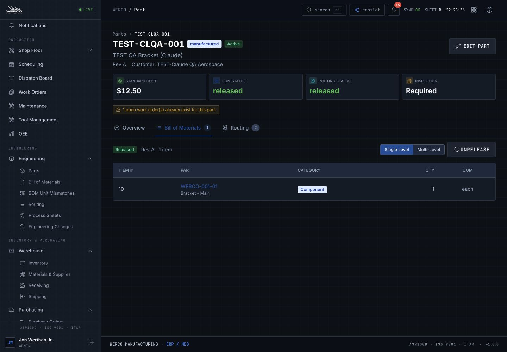
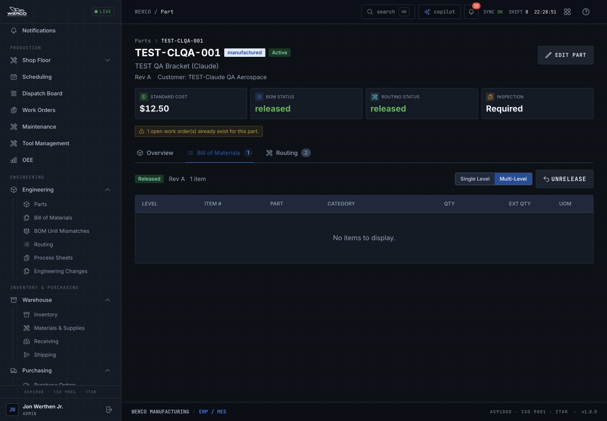
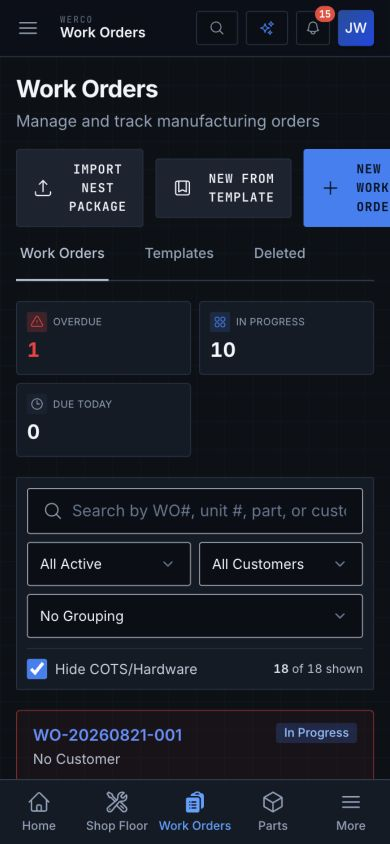

# Werco ERP/MES UX and UI audit

Werco has a substantial, increasingly consistent application foundation. The largest improvement is to make each screen lead reliably from a real operational condition to the correct next action. Fix incorrect transitions and misleading outcomes first, shorten the route to daily work next, then refine the visual system across modules.

The live review reproduced three concrete defects: **Receiving’s Inspection Queue opens Inventory; Multi-Level BOM hides an existing component; and a dialog’s Purpose options open behind the dialog.** It also found a clipped mobile New WO action, a shop-floor queue pushed below a screen of machine choices, and saved quotes that cannot be fully reviewed from their selected state. Source review found additional high-impact defects in bulk scheduling, routing overrides, quote conversion, partial shipping and traceability.

**Review date:** September 6, 2026, Central time. **Live application:** [wercomfg.app](https://wercomfg.app). **Role:** signed-in administrator. **Evidence:** 30 captured states, frontend/backend contract review and targeted read-only interaction. There were no production business-record mutations or outbound messages.

- [Screenshot walkthrough — all 30 steps with images and findings](screenshot-walkthrough.md)
- [Implementation backlog — 25 consolidated packages, owners and acceptance checks](implementation-backlog.md)
- [Source coverage and module-level evidence](source-coverage.md)
- Detailed source reviews: [foundations](source-reviews/foundations.md), [production](source-reviews/production.md), [operations](source-reviews/operations.md), [specialist modules](source-reviews/specialist.md), [quoting and reports](source-reviews/quoting.md).

## Evidence and interpretation

**Live** means the behavior or layout was observed in this browser session and tied to a saved screenshot. **Source** means the current code/contract supports the finding, but its failure path was not executed against production. **Verification item** means the code suggests a risk requiring targeted testing or integration investigation. **Design recommendation** is a proposed improvement based on observed task friction, without claiming a functional defect or measured productivity loss.

The original local checkout was 317 commits behind the fetched main branch. Its product code and checked-out revision were left unchanged; only audit artifacts were added. Every source finding was revalidated against [commit 0a383b8c63926dd02e2a37c5153b43a3b095631b](https://github.com/jwerthen/Werco-ERP-MES/tree/0a383b8c63926dd02e2a37c5153b43a3b095631b), extracted into a separate temporary snapshot. This is the current repository evidence, not a claim that the deployed bundle exposes that exact commit. Live findings stand on their browser evidence independently.

The five specialist reviews contain 58 labelled entries. Those are **not 58 unique bugs**: several describe the same shared issue from different modules. The implementation backlog consolidates this material into 25 work packages and also includes the live design findings. The source inventory has 89 route declarations, including redirects, aliases, public/print variants and the wildcard; it does not represent 89 visually audited workflows.

## First fixes to prioritize

P1 means a high-impact interruption, incorrect user-intent mapping, or misleading operational result. P2 covers recurring efficiency, recovery and accessibility gaps. These are audit priorities, not incident classifications. No P0 production incident was established.

| Priority | Problem and consequence | Evidence | Concrete fix / proof of completion |
|---|---|---|---|
| P1 | Receiving Inspection Queue opens Inventory | Live steps 15–16; OPS-01 | Give outer and inner tabs separate URL keys. Queue, history, refresh and Back must stay in Receiving. |
| P1 | Multi-Level BOM shows an existing BOM as empty | Live steps 28–29; PROD-04 | Store the explode response’s items array. Both views must reconcile component quantities; failed reads show errors. |
| P1 | Required SelectField options are behind their modal | Live step 30; C2 | Unify overlay layers and focus scope. Options must be visible, clickable and keyboard-operable in visitor and scrap dialogs. |
| P1 | Scheduling “Select visible” selects unfiltered jobs | Source PROD-01 | Select the displayed IDs. With 3 matching jobs out of 12, the bulk request must contain exactly those 3. |
| P1 | Removing an inherited routing operation can be ignored on WO creation | Source PROD-02 | Track list-level routing overrides. Saving after a removal must preserve the reviewed operation list. |
| P1 | Quote conversion can use another line’s quantity and omit other parts | Source QUOTE-02 | Preview and persist line-to-WO mapping; a custom first line cannot supply a later part’s quantity. |
| P1 | Partial shipments lose their remaining quantity from Ready to Ship | Source OPS-02 | Track remaining fulfillment and keep it actionable until shipped or explicitly closed. |
| P1 | Serial search results use a lot-trace endpoint | Source OPS-03 | Dispatch by result type. Serial and lot records with the same identifier must trace independently. |
| P1 | Calculator → Create Quote loses the calculation; approved RFQ quotes have no next action | Source QUOTE-01/03 | Carry the exact estimate snapshot into a reviewable quote and align the Pending lifecycle with visible actions. |
| P1 | MRP “Process/Done” acknowledges action without creating supply | Source PROD-03; empty state seen at step 20 | Create/link the intended PO or WO, or explicitly say Mark reviewed and show the outstanding manual step. |
| P1 | Failed data loads can look like zero issues or production readiness | Source C3, PROD-05, SPC-UX-01 | Represent unknown/error/stale separately from empty/zero; preserve unaffected and last-good data. |
| P1 | NCR/CAR lifecycle is incomplete and quality lists stop at the first 100 records | Source OPS-04/05; limited live sample at step 21 | Add full review/disposition/closure and server pagination; the 101st matching record must be reachable. |
| P1 | Forgot password is an inert button | Source C1; sign-in surface step 1 | Provide an actionable recovery path and a verified return to the intended record. |

The quote Send to Customer action also needs prompt correction: its verified endpoint only marks status as sent. Relabel it **Mark as sent** if that is its intended function. If actual dispatch is intended, review recipient/document and display delivery outcomes. PO sending has a related wording concern, but an operational event is emitted there; inspect that integration before declaring that no dispatch occurs. See QUOTE-04 and OPS-11.

### Reproduced example: the same BOM changes from one component to empty

Single Level correctly displays one component:

Multi-Level then displays “No items to display” while the header retains “1 item”:

## Improve daily work across the app

### 1. Make overview metrics open the exact work they summarize

The Action Inbox is a useful direction: exceptions should lead to a manageable queue. Extend that behavior consistently. A dashboard overdue count of 7 currently leads to an All Active work-order list showing overdue 1 with Hide COTS enabled. That is a scope mismatch for the user; the audit did not determine which count is mathematically wrong.

Make every actionable metric carry its predicate, period and inclusion rules into a stable URL. Show the inherited filter chips at the destination and a clear way to widen the scope. For each urgent queue, expose the affected record, reason, due date, owner and next permitted action. Distinguish setup completion from ongoing production readiness.

On the dashboard, put overdue/blocked work and the next decision ahead of ten equal-weight cards and a full machine matrix. Let managers expand capacity when planning. In Purchasing, calculate Open POs from open statuses: current code uses the loaded list length, and the live table includes received orders. These changes improve trust as well as scanning. Evidence: steps 2–4, 18; C3/C12 and [Purchasing source at line 1636](https://github.com/jwerthen/Werco-ERP-MES/blob/0a383b8c63926dd02e2a37c5153b43a3b095631b/frontend/src/pages/Purchasing.tsx#L1636).

### 2. Put the current operation at the top of a work order

The work-order detail has useful context but makes users pass many statistics and large supporting panels before reaching the operation work. The captured header truncates labels; 1/1 quantity complete and 1/4 operations complete need explicit meaning.

Use a compact identity/status header with part, revision, unit, customer, due date and progress. Follow with a “Current operation / Next action” section and visible blockers/material readiness. Keep drawings one action away, with a compact attached-document preview; collapse empty upload, notes and support panels. Make operation progress and finished-quantity progress distinct. Present authorized early-completion overrides with the reason and consequence rather than relying on a generic Complete label.

In New WO, group part/quantity/customer/dates first, then routing review. Make optional serial inputs conditional on the part/workflow. Show the selected routing revision and deviations in the final review. Ensure the current part’s readiness has completed before submission or offer a deliberate supported override. Evidence: steps 5–6, 13–14; PROD-02/05/06.

### 3. Design shop-floor screens around the station and active job

At 390×844, the Time Clock’s 24 machine buttons push Up Next to approximately y=972 and Job Queue to y=1252. A useful queue exists, but users must scroll through machine selection to reach it. The initial selected machine was empty despite jobs on another station.

Use a compact searchable station selector showing queue counts; remember the workstation or user’s relevant station where appropriate. Put active work and the next job in the first viewport. Give the job enough identity to avoid selecting the wrong unit: WO, part, unit/serial, operation and status. Keep start/hold/complete controls readable and comfortably separated. Preserve the existing bottom navigation and explicit hold-reason workflow.

On the mobile work-order list, New WO extends to x≈414.7 in a 390 px viewport. Give the primary action a wrapping/full-width row, move secondary actions into a menu, and collapse advanced filters. Existing mobile cards should remain. Evidence: steps 9–12.

### 4. Keep planning compact and current

Scheduling expands 24 capacity cards before the actual planning task. Default to relevant machines and exceptions, retain the working collapse control, and use a clear current/next-week date rule. The captured Sunday view ended on Saturday; confirm the desired shop planning convention.

Dispatch already does several things well: hides idle machines, offers keyboard reorder controls, shows material/changeover information and reconciles local mutation failures. Extend it with due-date/remaining-duration context and links into job details. Its source currently has no automatic refresh from other stations. Add safe event/poll/focus reconciliation and an honest last-updated state; defer disruptive updates while dragging or editing. “LIVE” and “SYNC OK” in the shell are currently static and should reflect actual connection and data freshness. Evidence: steps 7–8; C4/C13, PROD-01/07/08/11/12.

### 5. Complete procurement, receiving and shipping handoffs

Use consistent module names: the current Purchasing & Receiving title conflicts with Receiving’s new Warehouse location. Give a PO a real detail page with lines, revision/status history, receipts, attachments and permitted edits; printing should be an explicit secondary action. Make vendor lookup searchable using the existing entity-picker pattern.

Receiving needs a short route from PO/vendor/expected delivery to the correct line. Keep the “select a PO” prompt near the top of its detail region and allow search without scrolling a long list. Render validation inside the active receipt/inspection dialog, beside the field and in a focused summary. Keep save progress visible to prevent repeat clicks.

Shipping should show ordered, already shipped and remaining quantity, unit/serial, customer and required date. Keep the remainder of partial shipments in an actionable queue. Make the difference between scheduling a known WO and a manual shipment clear. Evidence: steps 15–19; OPS-01/02/06/07/10/11/14.

### 6. Turn quality and traceability into investigation workspaces

NCR/CAR records need a full lifecycle: issue, affected material/WO, containment, disposition or corrective action, accountable owner, due date, evidence, approvals and closure history. The sampled void NCR still offers Void and displays Pending disposition; terminal states should have coherent labels and permitted actions. Preserve the more complete FAI workflow instead of applying the NCR/CAR criticism to it.

Traceability should distinguish “start a search,” “searching,” “no match,” and “search failed.” The submitted no-match query currently leaves an otherwise empty page. Related WOs, POs, NCRs and documents should be navigable, with the query/selected record preserved in the URL. Serial matches must use serial tracing. Quality pagination must cover the backend dataset, not only paginate the first 100 downloaded rows. Evidence: steps 21–22; OPS-03/04/05/12.

### 7. Connect estimating, quote review and production conversion

Selecting the captured 13-line quote reveals only number, customer and total. The user cannot review those 13 lines, terms or notes from the selected panel. Provide a proper quote detail and draft-edit path, revisions, estimate provenance and clearly permitted lifecycle actions.

Keep calculated prices tied to the exact inputs that generated them. Editing quantity/material/geometry/rush should mark the result stale or recalculate; never mix old prices with a new displayed multiplier. Carry the calculation into a prefilled quote review. RFQ approval should open the returned quote ID and a clear next action. Before conversion, preview eligible lines, quantity and target WO, including deferred service/custom lines and any remaining unconverted scope. Evidence: steps 23–24; QUOTE-01 through QUOTE-07.

### 8. Make documents, reports and specialist tools explain their context

Documents has useful search/type filters and access to 203 records. Add an in-app preview and visible revision navigation, linked part identity and current/superseded status so users can verify the right drawing before download. Keep delete secondary.

Reports labels its 14-day/90-day panels; retain that clarity and explain which panels the top period selector affects. Define metric denominators and units, especially utilization over 100%. Use consistent thousands/currency formatting and provide readable chart values. Preserve tab and period in shared URLs and allow all employee time entries to be inspected; source currently truncates each employee’s rows to ten while showing the full total.

Maintenance, tools, certifications, ECO and supplier audits should use searchable names/codes instead of database IDs. ECO must reject malformed scope input instead of dropping or truncating tokens. Preserve tab/filter state after tool actions, and do not leave old OEE results under new filters. Calibration’s global summaries should retain their stated scope when filters change. Evidence: steps 25–26; OPS-08/09/13, REPORT-01/02, SPC-UX-01 through SPC-UX-06.

### 9. Finish the shared UI contracts

The existing dark design can support the product well. Keep the broad component work already in place and standardize the remaining behaviors:

- **Text and identifiers:** use a brighter link/selected-text color on dark surfaces. Source token #1B4D9C has calculated contrast of about 2.13:1 on #141B26; validate computed colors in each actual context. Give long part/WO identifiers sufficient width and a useful full-value treatment.
- **Hierarchy and density:** reserve strong color for the primary action and exceptions. Use compact headers and optional detail disclosure; avoid filling the first viewport with equal-weight KPIs. Standardize spacing, currency, quantity, units, dates and complete priority definitions.
- **Forms and overlays:** give every modal an accessible name, correct focus behavior and a common overlay stack. Put validation in the current interaction. Reuse searchable entity selectors rather than raw IDs or large native lists.
- **Async actions:** scope pending state to the row/action, preserve entered data on failure, show durable partial-success details and guard repeat submissions. Four-second error/warning toasts are too transient for instructions users must act on; retain them inline or until dismissed.
- **Navigation and search:** preserve destination through sign-in, synchronize URL filters with Back/Forward, guard dirty SPA navigation, and derive visible actions from permissions. Fix global-search request races and distinguish failed search from no results.
- **State reconciliation:** synchronize notification bell/inbox counts and filtered rows, label bulk scope explicitly, and show truthful stale/offline state. Verify the session-warning timer lifecycle with deterministic tests before changing timeout policy.

Reflow acceptance should cover 320 CSS px and 200% text zoom, with wide-table scrolling limited to the table rather than the whole task. Review touch-target spacing and complete keyboard interaction, including modal layering and selected-tab semantics. These are targeted checks, not a claim of current WCAG conformance. Relevant primary guidance: [W3C reflow](https://www.w3.org/WAI/WCAG22/Understanding/reflow.html), [modal dialog pattern](https://www.w3.org/WAI/ARIA/apg/patterns/dialog-modal/), [target size](https://www.w3.org/WAI/WCAG22/Understanding/target-size-minimum.html), and [status messages](https://www.w3.org/WAI/WCAG22/Understanding/status-messages.html).

## Delivery sequence and validation

**First pass — operational correctness.** Fix the three reproduced defects, hidden bulk selection, routing override persistence, line-to-WO conversion, partial-shipping remainder, trace-result routing and truthful action statuses. These should each have small, outcome-based regression tests. Implement them on the current main branch in an isolated checkout, because the user’s present checkout is older.

**Second pass — shared reliability and daily workflows.** Complete data freshness/error states, pending actions, navigation guards, accessible overlays and entity pickers. In parallel, reshape work-order/Time Clock headers and the mobile primary action. Keep existing shared primitives and extend them, rather than proliferating page-specific alternatives.

**Third pass — complete record workspaces.** Quote/PO/quality detail and lifecycle work, server query/history, document revision preview and fuller traceability navigation. These need frontend and backend contracts agreed together.

**Fourth pass — refine and measure.** Apply consistent tokens, number/date formats, chart definitions and help discovery. Conduct usability sessions with a planner, operator, receiver, quality user and administrator on their actual workstation sizes. Validate that changes reduce task time without losing operational context.

The [25-package backlog](implementation-backlog.md) includes owners, dependencies, relative S/M/L estimates and detailed acceptance criteria. These are sizing aids, not delivery dates. Establish performance baselines before claiming speed improvements: time from sign-in to intended record, time to first actionable job, time to locate a PO line, completion/error recovery rates, primary route LCP/INP and data freshness age. No synthetic savings or runtime performance numbers were invented for this audit.

## What is already working

Current main has broad adoption of shared forms, tables, modals, loading buttons, errors, toasts and mobile cards. Confirmations/focus handling, route titles, scroll restoration, shop-local shift display and multiple error/retry paths were recently improved. Dispatch has thoughtful keyboard alternatives. Part lookup includes metadata, BOM displays revision/release context, Documents searches the full catalog, Reports handles sections independently, and nesting has draft/stale-result protections. Preserve these strengths and target the remaining gaps precisely.

## Coverage limits

The 30-state walkthrough covers representative administrator paths across overview, production, planning, Warehouse, procurement, MRP, quality, traceability, quotes, documents, reports, parts/BOM and a visitor dialog. The [coverage matrix](source-coverage.md) identifies source-only and unreviewed surfaces. This is not a visual pass over every route or every role.

No production work orders, inventory, shipments, POs, quotes, quality records, visitors or messages were created/changed. No live failure injection, cross-session production changes, actual screen-reader session, physical-device/glove testing, security audit, compliance certification, accounting validation, Web Vitals measurement, or end-to-end create/complete/send test was performed. MRP had no runs to inspect; quality/quotes included sparse pre-existing test data. Native-dialog/browser tooling stalled once on unsaved WO cancellation, then recovered after user reload; that is a coverage limitation, not evidence of an application freeze.

The canonical app’s sign-in and role-switch behavior, public kiosks/TV displays, print output, customer complaints/QMS, import/AI-estimate flows and administration subflows still need targeted follow-through where the matrix marks them unreviewed. The live app was returned to Action Inbox and its viewport restored. Only audit artifacts were added to the workspace; no product code or deployment changed.
