# Werco ERP/MES — screenshot walkthrough

Captured September 6, 2026 (shop-local Central time). Health applies to the sampled step, not the entire module. Each image is the actual saved browser capture; no mockups or reconstructed screens. Desktop captures are generally 1440×1000; steps 11–12 use 390×844. Step 1 predates sign-in on the canonical app host.

[Main audit](README.md) · [Implementation backlog](implementation-backlog.md)

## 01. Sign-in — Limited

The initial Railway sign-in surface was captured before the user signed in on wercomfg.app.

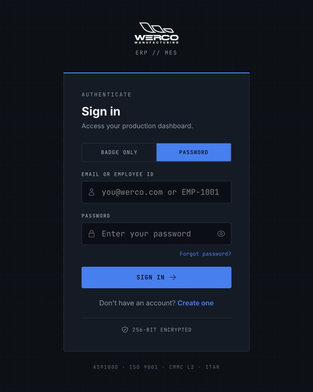

**Assessment:** Clear sign-in entry point. Current-source review finds the recovery button has no action; this was not exercised after authentication.

**Improvement:** Implement real account recovery and preserve the requested destination through sign-in.

**Evidence limit:** No password reset, session expiry, or alternate role sign-in tested.

## 02. Action Inbox — Needs improvement

The inbox presents urgent issue categories and affected-item counts.

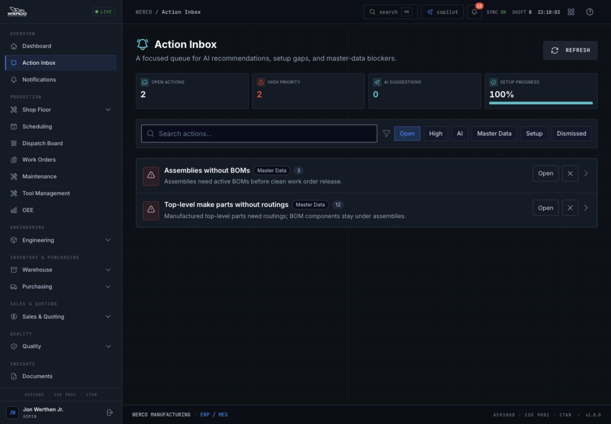

**Assessment:** Useful consolidation of exceptions. Generic Open actions lose the affected-record scope; setup completion and operational blockers need distinct explanations.

**Improvement:** Open a filtered affected-record queue with an explicit count, owner and next action.

**Evidence limit:** Counts are a point-in-time sample; no blockers were changed.

## 03. Dashboard — Needs improvement

Ten similarly weighted metrics and a large machine-capacity section occupy the overview.

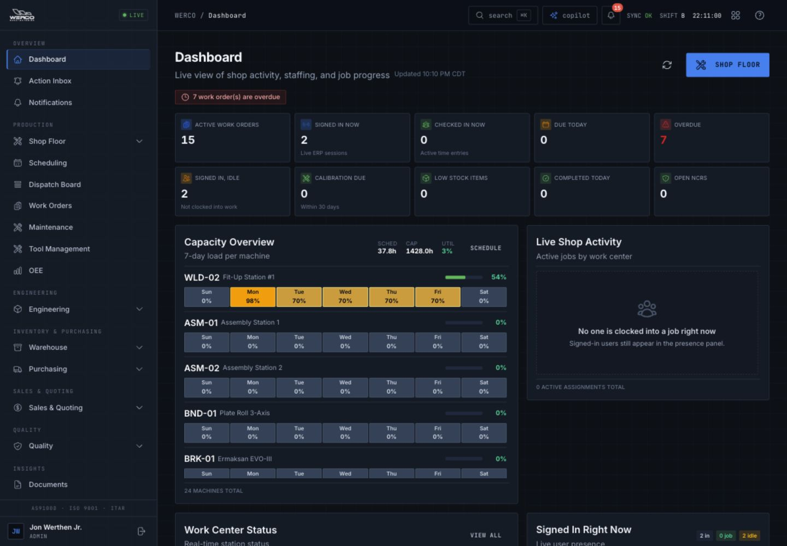

**Assessment:** Broad operational visibility, but the screen requires scanning many equally prominent cards. An overdue count of 7 does not carry its scope into the destination.

**Improvement:** Lead with exceptions and actionable queues, then supporting capacity and trends. Label period, filters and freshness.

**Evidence limit:** No latency or failure injection performed in production.

## 04. Overdue → work orders — Needs improvement

Clicking the overdue dashboard link opens the work-order list in All Active with Hide COTS selected; this list shows overdue 1.

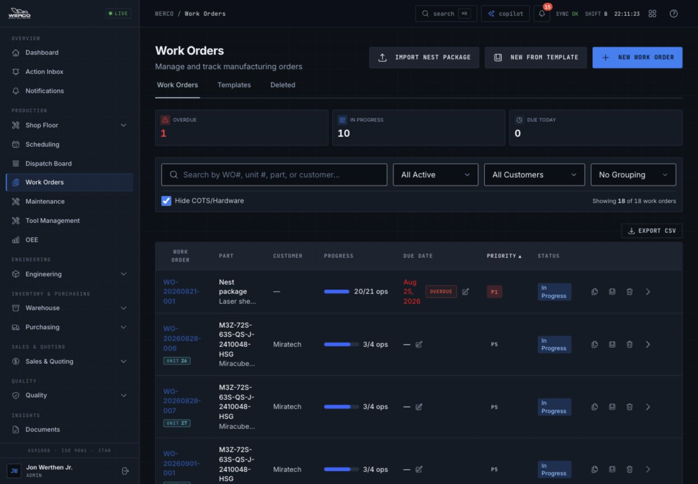

**Assessment:** Existing filters and table controls are useful. The count and destination scope are hard to reconcile, and long identifiers wrap repeatedly.

**Improvement:** Pass the actual overdue predicate into the URL; show inherited filter chips and count scope. Give identifiers more room.

**Evidence limit:** The audit does not establish which count is mathematically correct; filters differ.

## 05. Work-order detail — Needs improvement

The detail header has nine metric cards with truncated labels. Sample quantity completion is 1/1 while operation progress is 1/4.

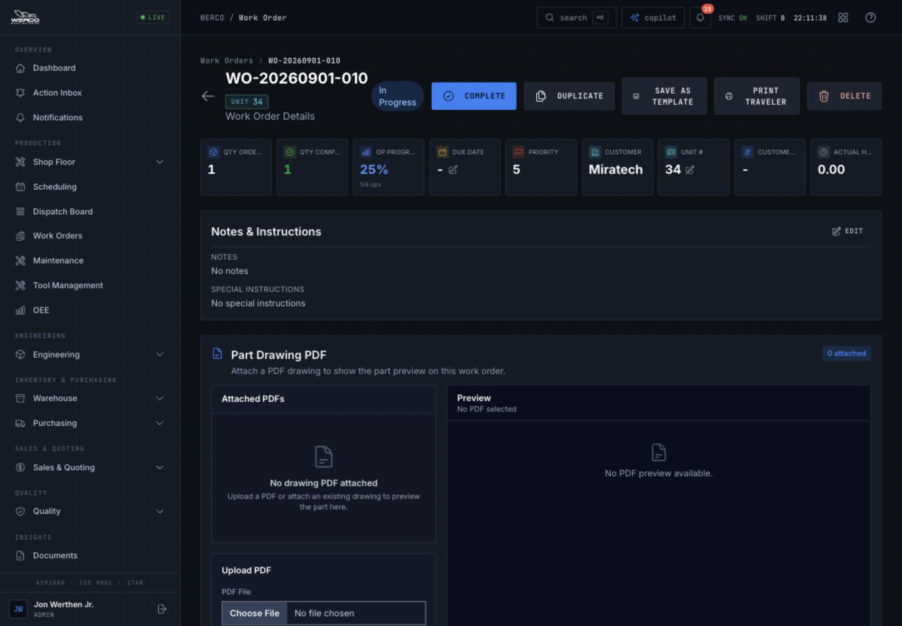

**Assessment:** Rich job context exists. Completion measures and the strong Complete action need a clearer relationship.

**Improvement:** Lead with next operation, blockers, due date and readiness. Explain quantity completion versus operation completion and any authorized override.

**Evidence limit:** Completion was not activated; the sample may reflect an intentional admin workflow.

## 06. Work-order secondary panels — Needs improvement

Large empty drawing/upload/preview and supporting panels precede the routing work farther down the page.

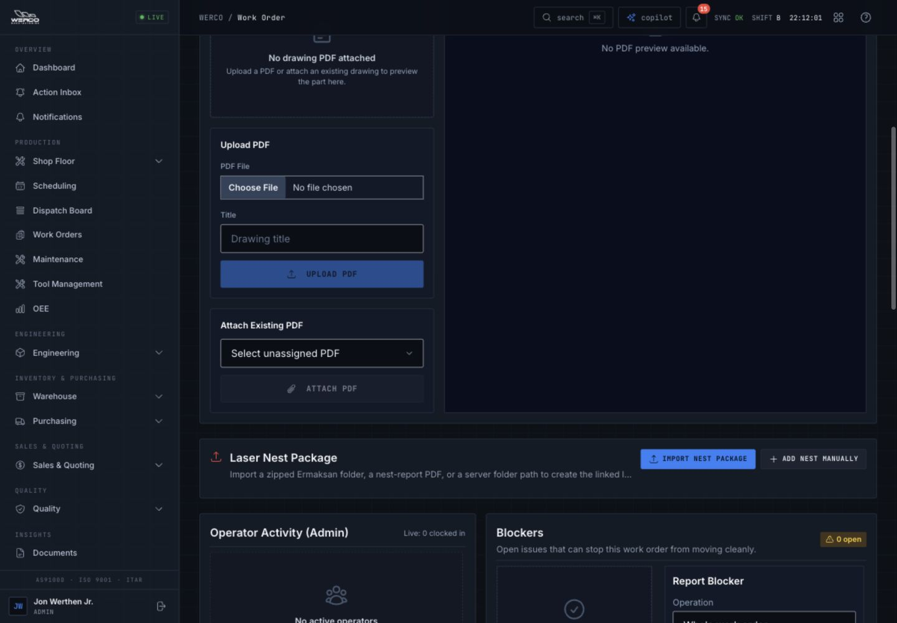

**Assessment:** Documents and blocker reporting belong in job context, but empty optional panels consume task space.

**Improvement:** Collapse empty/supporting panels and surface current operation first. Replace implementation-oriented material/backflush prose with operator-facing consequences.

**Evidence limit:** This image shows secondary panels, not the operations table.

## 07. Scheduling — Needs improvement

The initial view expands capacity for 24 machines before the main planning work; the shown Aug 31–Sep 5 window excludes the current Sunday.

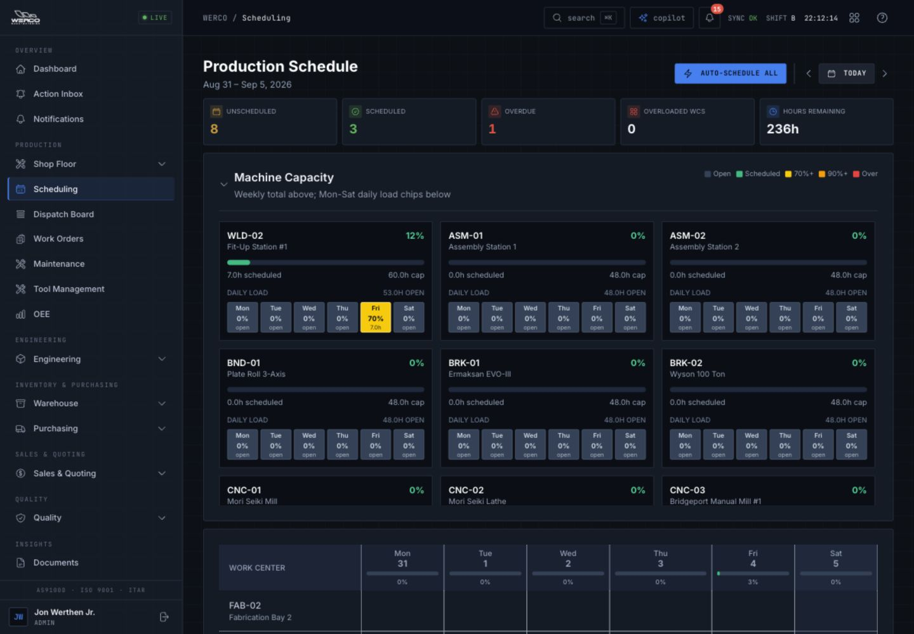

**Assessment:** Capacity can be collapsed. Selection and mutation issues identified in source are described separately.

**Improvement:** Default to relevant machines and a useful planning window; preserve a compact capacity toggle and visible queue.

**Evidence limit:** No jobs selected for a bulk action or rescheduled.

## 08. Dispatch Board — Usable; freshness gap

The board hides 22 idle machines and shows two active machine columns with 10 jobs.

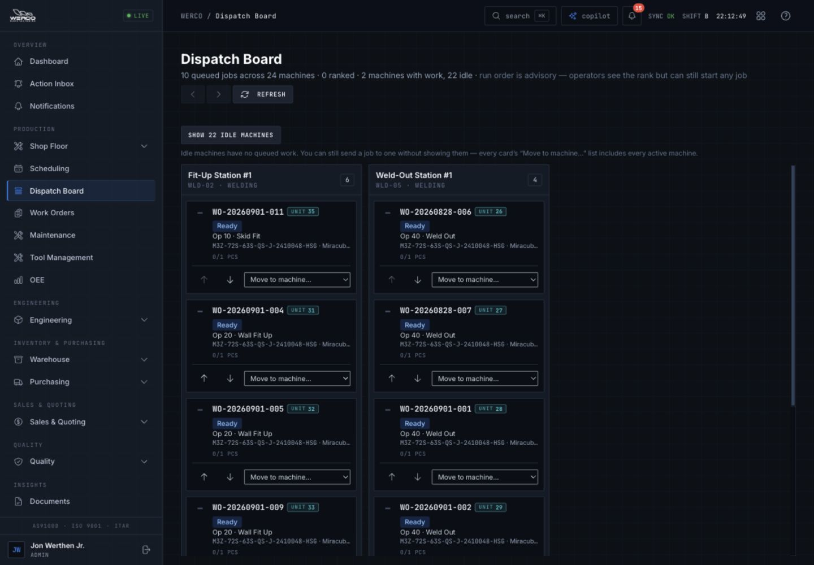

**Assessment:** Strong focus on machines with work, keyboard equivalents and material/changeover context. Source shows no automatic cross-station refresh.

**Improvement:** Add truthful updated-at state and safe reconciliation; expose due dates, remaining duration and job-detail links where useful.

**Evidence limit:** No reordering or cross-session mutation tested.

## 09. Time Clock initial selection — Needs improvement

The initial machine selection has an empty queue while work exists on other machines.

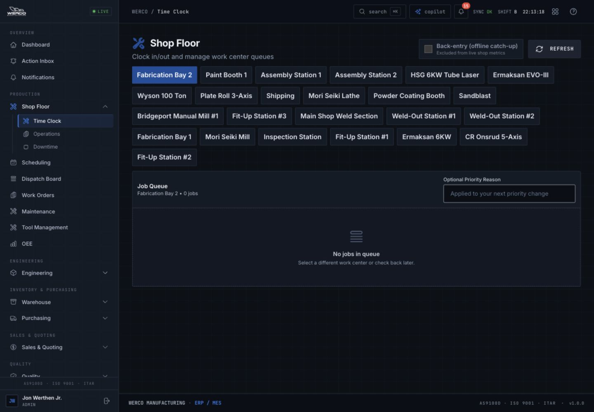

**Assessment:** Machine choice is explicit, but 24 buttons do not reveal where the work is.

**Improvement:** Remember the station or user preference; show queue counts and relevant/favorite machines.

**Evidence limit:** Initial selection observed in this session only; do not infer every user gets the same default.

## 10. Time Clock populated queue — Usable; hierarchy gap

Selecting Fit Up Station #1 reveals six jobs and an Up Next strip.

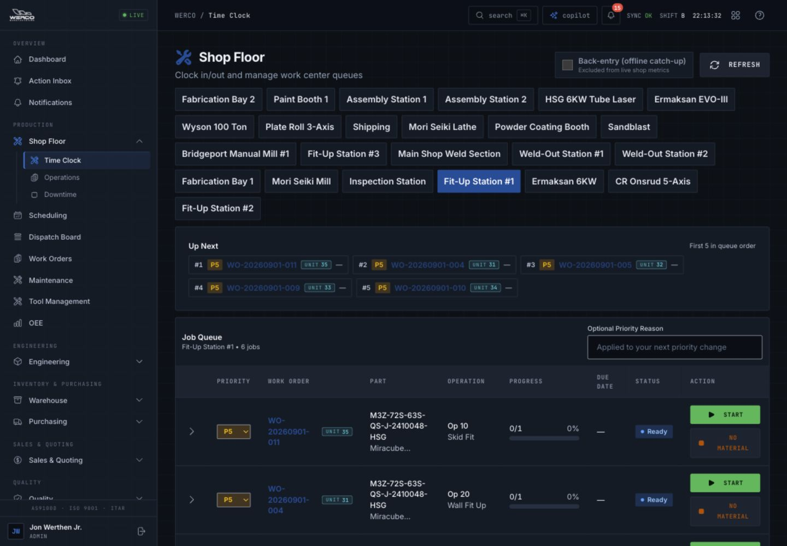

**Assessment:** The queue supports direct production work. The top strip repeats jobs without enough operation context.

**Improvement:** Prioritize current operation and start/hold/complete context; include operation names in previews.

**Evidence limit:** No timers started or stopped.

## 11. Time Clock at 390 px — Needs improvement

Machine buttons fill the first screen. DOM measurement puts Up Next near y=972 and Job Queue near y=1252.

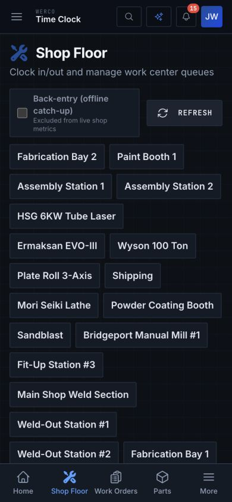

**Assessment:** Mobile bottom navigation exists. The actual task is more than a screen below machine selection.

**Improvement:** Use a compact searchable station picker with queue counts; keep active job/next job in the first viewport.

**Evidence limit:** 390×844 browser viewport, not physical-device or glove testing.

## 12. Work orders at 390 px — Needs improvement

New WO extends to x≈414.7 in a 390 px viewport. Header and filters push the first job card down to about y=710.

**Assessment:** Mobile cards already exist. The primary create action clips beyond the viewport.

**Improvement:** Wrap the primary action or give it its own row; move secondary actions into overflow and collapse optional filters.

**Evidence limit:** Measured one narrow viewport; 320 px and larger-device sweeps remain acceptance work.

## 13. New work order: part picker — Usable; hierarchy gap

The form provides a searchable part picker with part type/revision metadata.

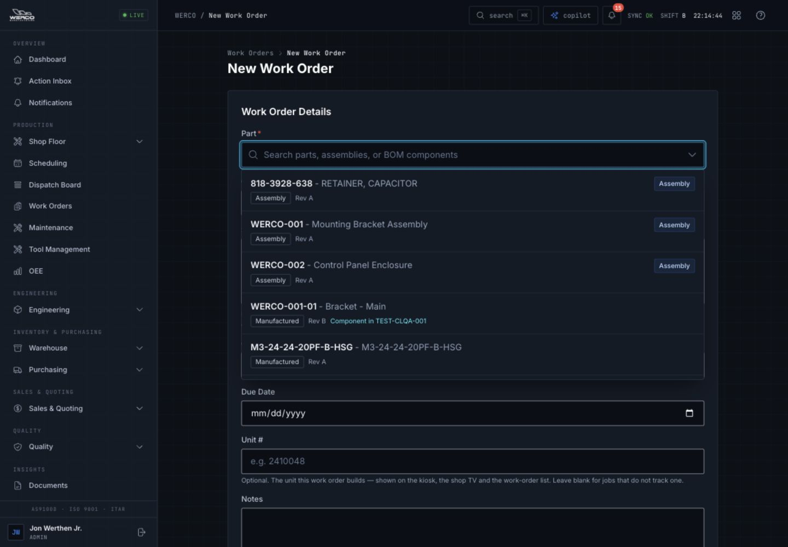

**Assessment:** A useful entity selector. Optional serial information occupies substantial space before routing review.

**Improvement:** Group essential planning inputs first; reveal traceability fields when applicable and provide a compact review summary.

**Evidence limit:** No work order submitted.

## 14. New work order: selected part — Needs improvement

Part selection loads customer/routing context and an existing-open-work-order warning. Create was visible during routing loading.

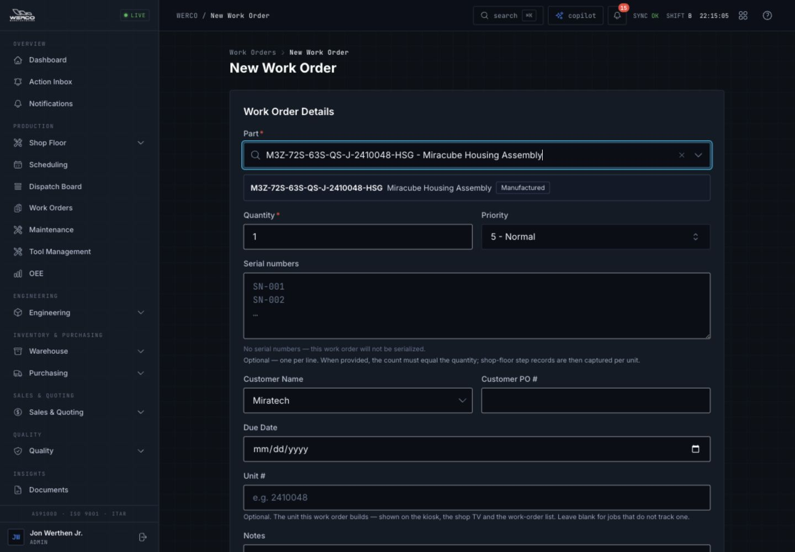

**Assessment:** Reuse of master data saves typing. Readiness needs an explicit current/loading/failed state; source confirms request-order risk.

**Improvement:** Tie preview and submit eligibility to the current part request. Keep the selected routing and deviations visible in final review.

**Evidence limit:** Cancel triggered a browser-tool/native-dialog stall; user reload restored access. No app-freeze conclusion or create outcome is claimed.

## 15. Warehouse receiving — Needs improvement

Nested Warehouse/Receiving tabs, summary cards and a long PO list leave a large empty detail region in the first viewport.

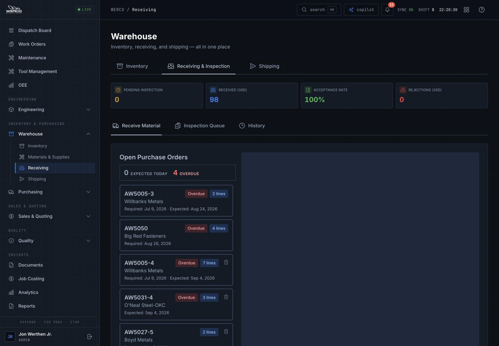

**Assessment:** PO-based receiving is a sensible starting point. The selection prompt is displaced by the long list.

**Improvement:** Keep the prompt at the top of the detail panel and add quick PO/vendor lookup plus expected/overdue filters.

**Evidence limit:** No receipts or inspections recorded.

## 16. Receiving → Inspection Queue — Broken

Clicking Inspection Queue changes the URL to /warehouse?tab=queue and renders Inventory.

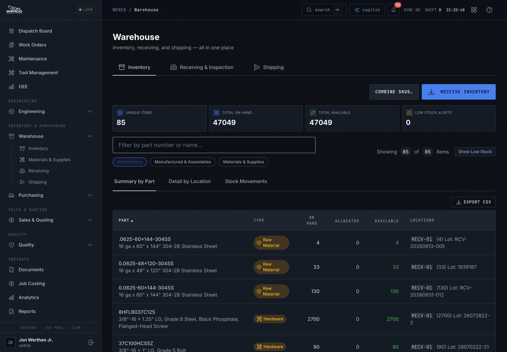

**Assessment:** The wrong module opens. Current source confirms the outer Warehouse tab and inner Receiving tab use the same query key.

**Improvement:** Use distinct URL state, such as tab=receiving&receivingTab=queue, and test refresh/Back/deep links.

**Evidence limit:** Browser-confirmed read-only navigation defect.

## 17. Shipping — Needs improvement

Ready to Ship shows 43 rows with repeated Schedule Shipment actions and little visible narrowing support.

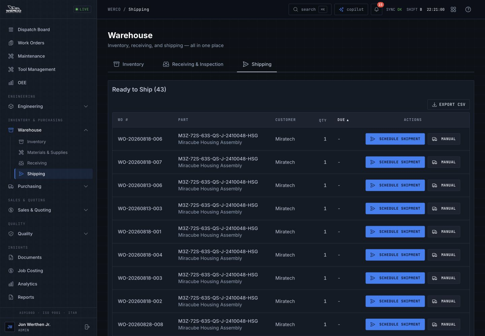

**Assessment:** Status queues are useful. Similar part rows need unit/WO identity, remaining quantity and useful date/customer filters.

**Improvement:** Add fulfillment context and a searchable queue; clarify Manual versus schedule-from-WO. Preserve partial-shipment remainder until fulfilled.

**Evidence limit:** Partial-shipment failure is source-traced, not executed live.

## 18. Purchasing — Needs improvement

The title says Purchasing & Receiving although receiving is elsewhere. Open POs shows 54 while the table includes received records. The Deleted segment is cramped.

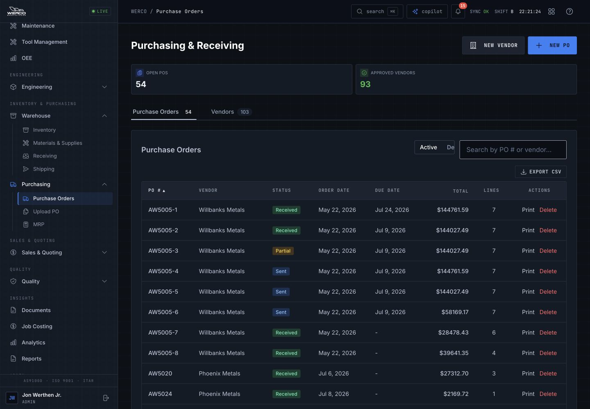

**Assessment:** PO statuses and vendor context are visible. The current Open POs value is the whole loaded list length.

**Improvement:** Correct summary scope and terminology, give filters adequate space, format currency consistently, and make row click open PO detail.

**Evidence limit:** Source verifies list-length count and print-focused row interaction; no print or vendor message triggered.

## 19. New PO dialog — Usable; picker improvement

The clean dialog opens with vendor selection, date, line items and notes.

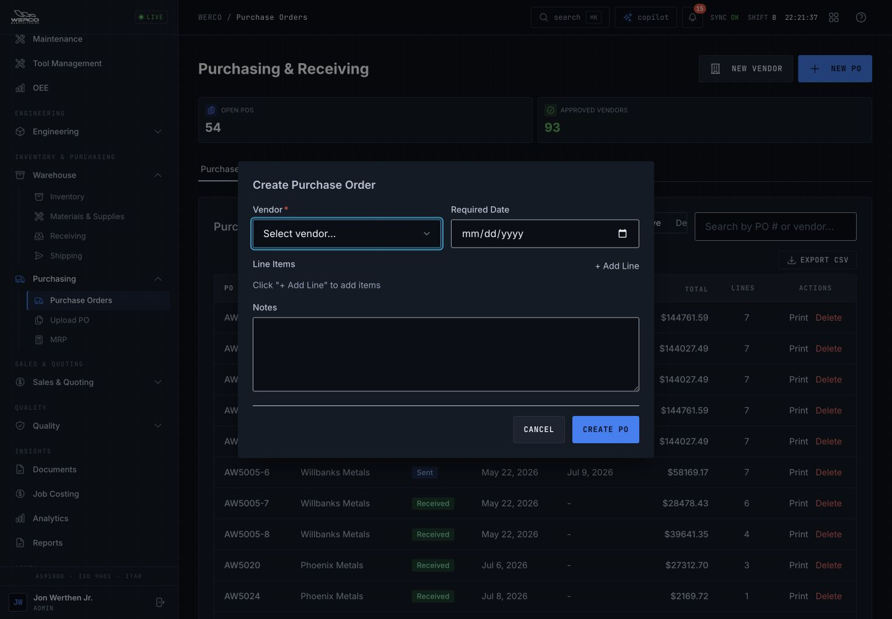

**Assessment:** A coherent contained form. The native vendor list has many options, making known-vendor lookup slower.

**Improvement:** Use the established searchable entity picker; validate at the field/line and keep submit progress in the dialog.

**Evidence limit:** Opened and dismissed without entering or saving a PO.

## 20. MRP empty state — Needs improvement

No runs exist; the first metric says Run undefined while cards show zeros.

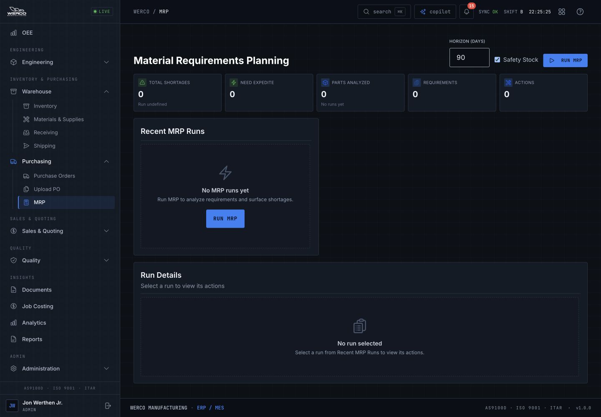

**Assessment:** The main empty state explains how to begin, but undefined and pre-run zeros imply an analysis that has not occurred.

**Improvement:** Show Not analyzed until a run succeeds; remove redundant empty panels. Make action resolution describe actual supply creation or manual follow-up.

**Evidence limit:** MRP was not run; Process behavior and run races are source-only.

## 21. Quality management — Needs improvement

NCR/CAR/FAI navigation and summary filters are present. The sampled void NCR still offers Void and pending disposition.

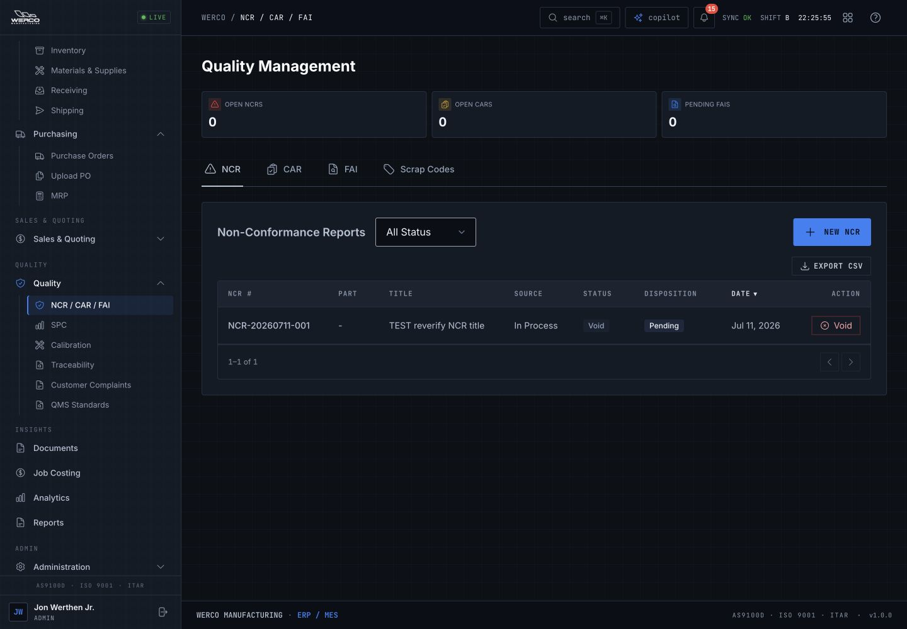

**Assessment:** Shared table and status filters exist. NCR/CAR lifecycle detail remains missing in current source; the void row needs terminal-state treatment.

**Improvement:** Provide review, disposition, owner, evidence and closure flows; disable irrelevant terminal actions and paginate the server dataset.

**Evidence limit:** Sample contains a pre-existing test record. No record was voided or edited; FAI has more complete detail behavior.

## 22. Traceability no-match search — Needs improvement

Submitting AUDIT-NO-MATCH-20260906 leaves only the search field and Trace button with no result or no-match message.

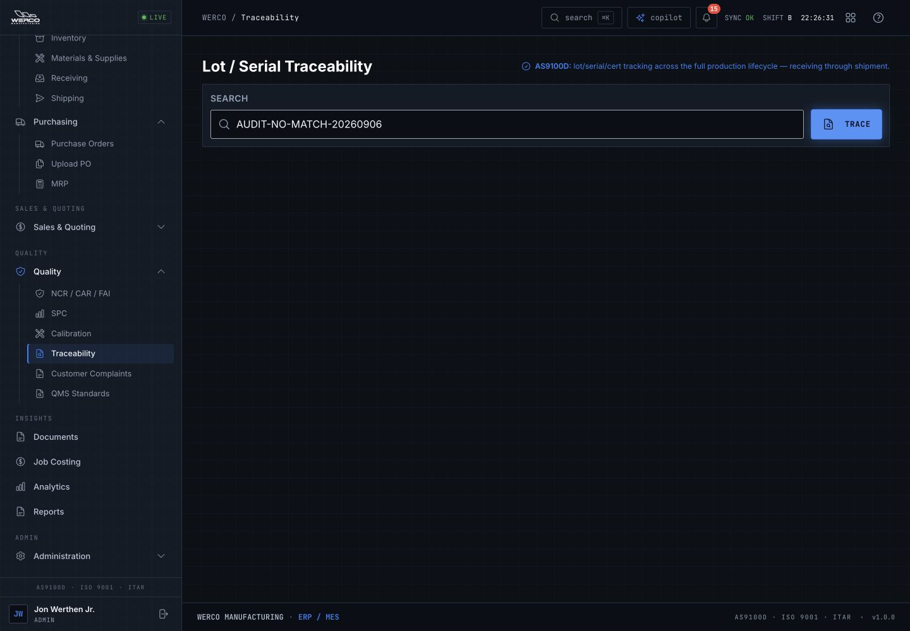

**Assessment:** The lookup supports several useful identifiers. Silence gives no confirmation that the search completed.

**Improvement:** Distinguish initial/searching/no match/error states; offer query guidance and linked related records. Dispatch serial matches to serial tracing.

**Evidence limit:** No-match behavior observed; serial endpoint mismatch is source-only.

## 23. Quotes list — Needs improvement

The table shows two saved quotes, dates, line counts and a Send to Customer icon for the draft.

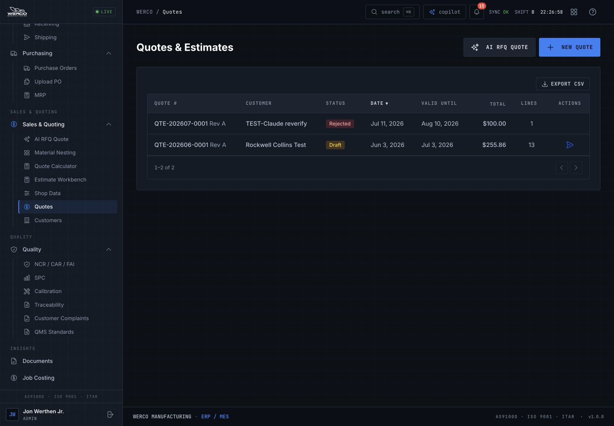

**Assessment:** The summary is compact. History/status search is missing and send wording overstates the verified status-only endpoint.

**Improvement:** Provide Open/Converted/Expired views and truthful send/delivery states. Review the exact recipient/document only if sending is implemented.

**Evidence limit:** No customer message was sent or quote status changed.

## 24. Selected quote — Incomplete

Selecting a 13-line quote opens a summary with number, customer and total; the lines remain inaccessible here.

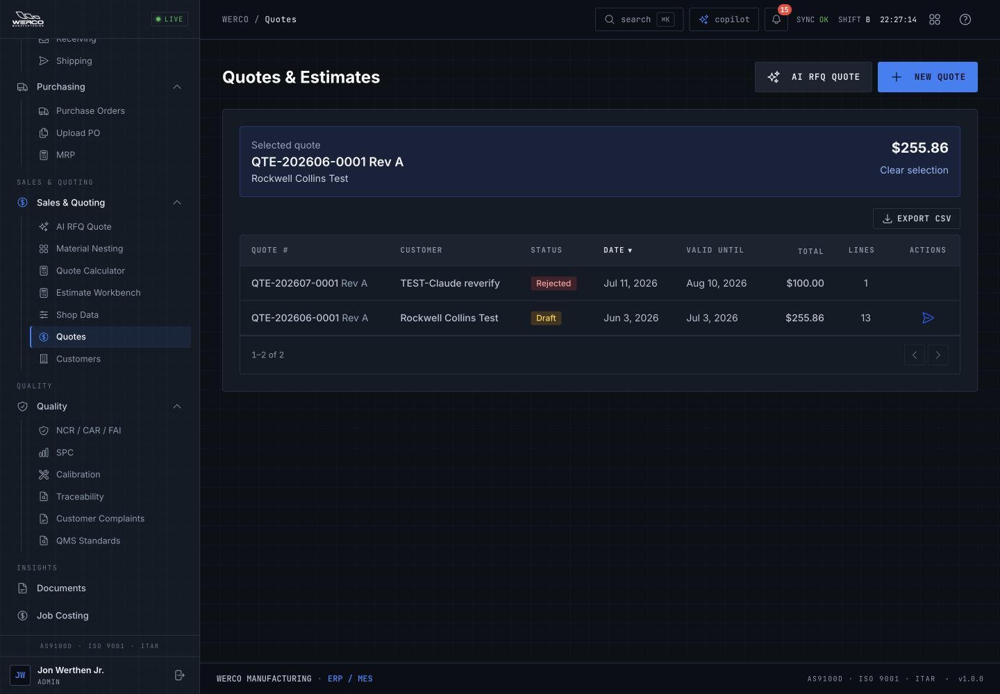

**Assessment:** Selection is reflected visibly, but the next review step is absent.

**Improvement:** Open a full detail page with lines, terms, revision history and draft edits; preview line-to-WO conversion explicitly.

**Evidence limit:** Browser-confirmed summary limitation. Conversion defects are source-only.

## 25. Documents — Usable; workflow gap

The library has search/type filtering and 203 records, with Download and Delete row actions.

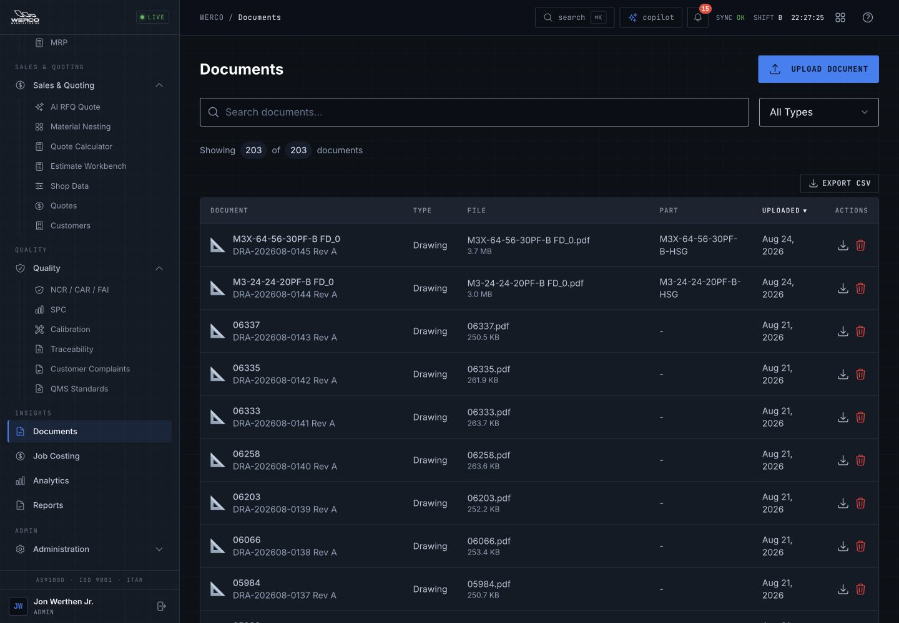

**Assessment:** Catalog search and pagination are useful. Reviewing documents requires download and revisions lack a visible navigation flow.

**Improvement:** Add in-app preview, linked part/revision history and current/superseded status. Keep destructive actions secondary.

**Evidence limit:** No files downloaded, uploaded or deleted; no document contents audited.

## 26. Reports dashboard — Usable; clarity gap

The screen combines period-based metrics, a separately labelled 14-day chart, 90-day vendor data, and machine utilization.

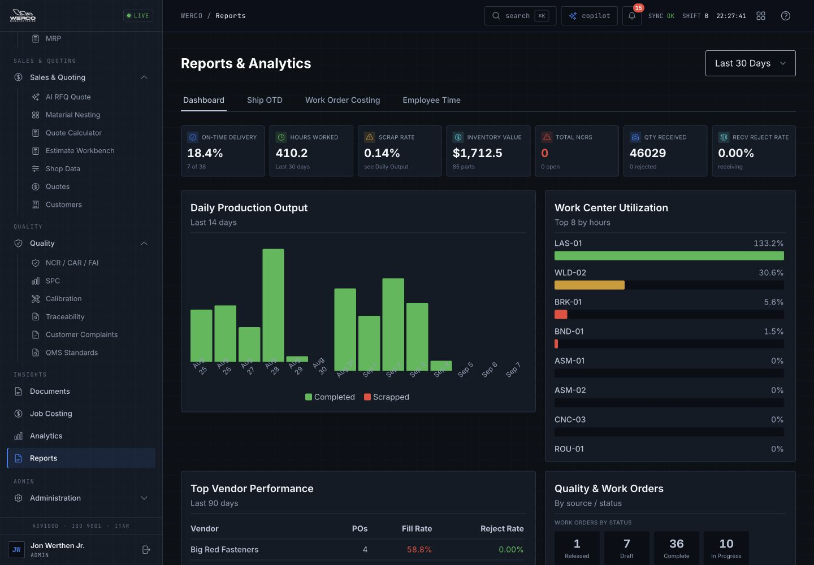

**Assessment:** Individual panel windows are labelled. Utilization at 133.2% needs its denominator/meaning explained; chart labels are crowded.

**Improvement:** Expose metric definitions, consistent number formatting and accessible chart values; persist tab/period in URLs and make all employee entries reachable.

**Evidence limit:** No financial accuracy conclusion. Employee entry truncation and history-state behavior are source-traced.

## 27. Parts catalog — Usable; readability gap

Search, filters, saved filters, table/grid options and component visibility are available.

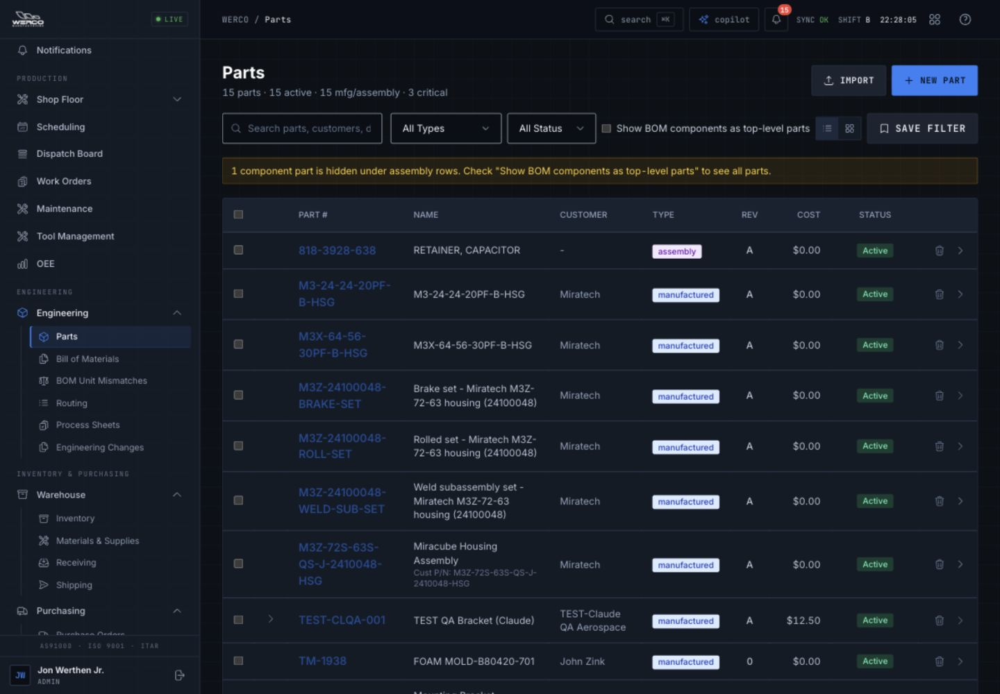

**Assessment:** The hidden-component explanation is helpful. Dark blue identifiers and heavily wrapped part numbers impede scanning.

**Improvement:** Use a brighter dark-surface link token and allocate identifier width; preserve the existing catalog controls.

**Evidence limit:** No part edited. Screenshot rendering softness is not treated as a product defect.

## 28. Part BOM: Single Level — Usable

Released Rev A has one item: WERCO-001-01, quantity 1 each.

**Assessment:** Part identity, release state, revision and quantity are visible together.

**Improvement:** Preserve this context in all BOM views and support controlled draft-item editing.

**Evidence limit:** Read-only inspection of an existing test part.

## 29. Part BOM: Multi-Level — Broken

Switching the same BOM to Multi-Level shows No items to display while its header still says 1 item.

**Assessment:** This contradicts the prior view. Source confirms the response object is stored where the UI expects its items array.

**Improvement:** Use a typed explode response and display its items; distinguish failed reads from valid empty results.

**Evidence limit:** Browser-confirmed; no BOM changed or unreleased.

## 30. Visitor dialog Purpose picker — Broken

Purpose is expanded and the DOM contains six options, but the options render behind the Add visit modal. Escape closes the full dialog.

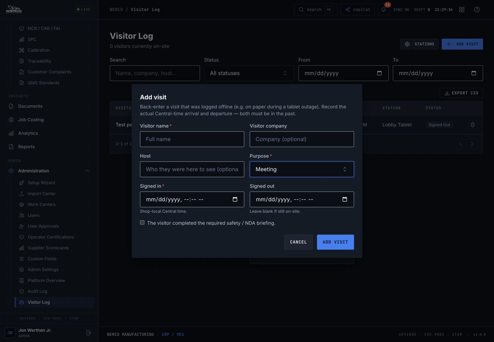

**Assessment:** The dialog has a name and clear time context. The required picker cannot be visually used as intended.

**Improvement:** Share overlay layers across Modal/SelectField/ComboBox; close the topmost popup first and retain form focus.

**Evidence limit:** Opened clean and dismissed; no visitor record created. Other SelectField-in-modal callers need regression coverage.
