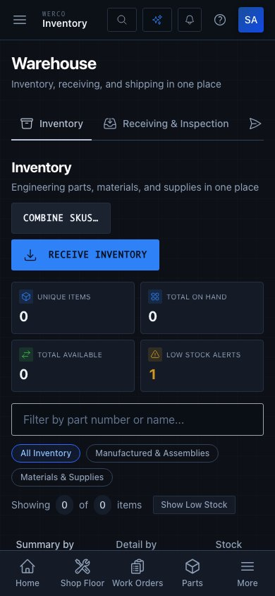
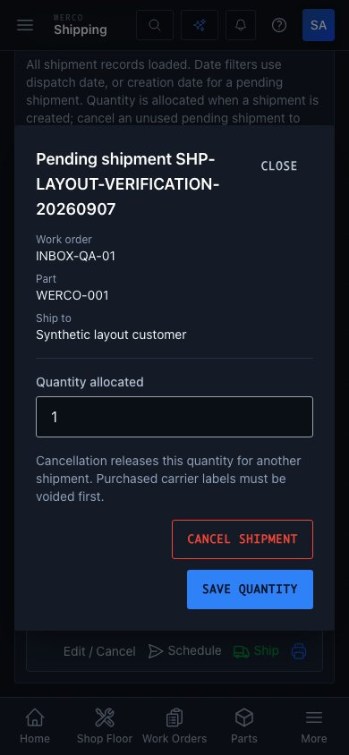
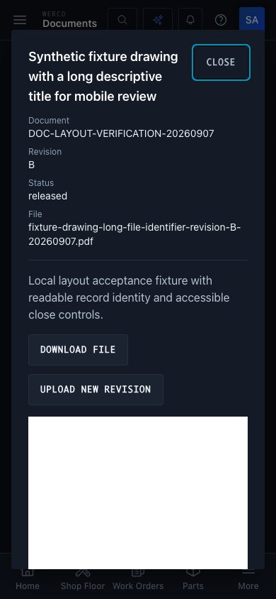

# Package 7 — consistent page and record context

Implemented on the synthetic next-worktree preview, September 7, 2026. This package supplies reusable headers and adopts them on six page components and three record/form details. It is a bounded layout improvement, not an app-wide accessibility certification.

## Shared patterns

[PageHeader](../../frontend/src/components/ui/PageHeader.tsx) keeps the title, description, metadata, and action group together. Long text wraps without widening the page; actions wrap beneath the title on narrow screens. Pages own one `h1`; embedded warehouse sections use `h2`. The component is rendered in loading, failed, and loaded states so the user keeps their location and purpose during a slow or unsuccessful request.

The same module exports `RecordHeader`: an `h2`, labelled `dl` record fields, and a visible, named Close button. The caller retains control over pending requests and unsaved-change guards. Closing a detail does not call a cancellation, deletion, or save endpoint.

| Screen | Coverage |
| --- | --- |
| [Warehouse](../../frontend/src/pages/Warehouse.tsx) | Shared page identity above the existing keyboard-accessible nested tabs. |
| [Inventory](../../frontend/src/pages/Inventory.tsx) | Title and breadcrumbs remain during loading/failure; receive/combine actions share one responsive group; embedded view has a section heading. |
| [Receiving](../../frontend/src/pages/Receiving.tsx) | Matching heading scale and concrete workflow description; named loading status; embedded section heading; wrapped notifications and labelled error dismissal. |
| [Shipping](../../frontend/src/pages/Shipping.tsx) | Title and description remain during loading/failure; embedded section heading; pending/manual details show named record context and a separate Close control. |
| [Dashboard](../../frontend/src/pages/Dashboard.tsx) | Title and Shop Floor link remain during loading/failure; checked/refresh metadata and actions wrap independently. |
| [Action Inbox](../../frontend/src/pages/ActionInbox.tsx) | Uses the same title, description, icon, and refresh action pattern above the operational queue. |
| [Document detail](../../frontend/src/components/operations/DocumentDetail.tsx) | Labelled document/revision/status/filename context, wrapping title and filename, short Download file action, and an explicit Close control through the existing revision guard. |

Pending shipment cancellation has the existing danger button style and remains distinct from Close. Both manual and pending shipment details block Close/Escape while their write is pending. A failed write keeps the form and its inline error visible. Document Close works during load failure, retains the existing dirty-revision confirmation, and is disabled during upload.

## Acceptance evidence

- 140 targeted frontend tests passed across 20 suites: the affected inventory, receiving, warehouse, dashboard, document, inbox, and shipping flows. Log: `/tmp/werco-next-layout-final-tests.log`.
- [Shipping layout regressions](../../frontend/src/pages/Shipping.layouts.test.tsx) cover page identity through loading/failure/retry, labelled context, Close without allocation mutation, and pending/failed writes for both shipment forms.
- [Document detail regressions](../../frontend/src/components/operations/DocumentDetail.test.tsx) cover Close during a failed load and preservation of the dirty revision guard. Existing preview/revision tests remain green.
- [Warehouse regression](../../frontend/src/pages/Warehouse.receivingTabs.test.tsx) asserts one page heading plus the receiving section heading while data loads, and retains the real data-router/Back tests. [Inventory](../../frontend/src/pages/Inventory.asyncState.test.tsx) and [Dashboard](../../frontend/src/pages/Dashboard.dedup.test.tsx) assert preserved page context during loading/failure.
- Owned files pass ESLint, Prettier, and `git diff --check`. Product and test TypeScript passed in the combined worktree check.
- Chromium at 390×844: Action Inbox, Dashboard, and all three warehouse sections each measured document width 390px. Both record dialogs measured width/scroll width 358px. One `h1` remained on each page. Header-scoped WCAG 2 A/AA and 2.1 AA axe checks returned zero violations; the entire pending-shipment dialog also returned zero. Close was exercised in both record dialogs, with no runtime page errors. [Machine-readable result](layouts-browser-result.json).

The browser fixture used fresh local SQLite preview data and synthetic records. No production records, carrier labels, messages, or business documents were written. This acceptance checks the document detail layout; it does not add a new native PDF viewer implementation.

## Mobile examples

Inventory actions wrap beneath the section description; Warehouse remains the page heading.

Pending shipment identity wraps, with Close separate from the business cancellation action.

Long document titles and filenames remain readable in the labelled record header.

